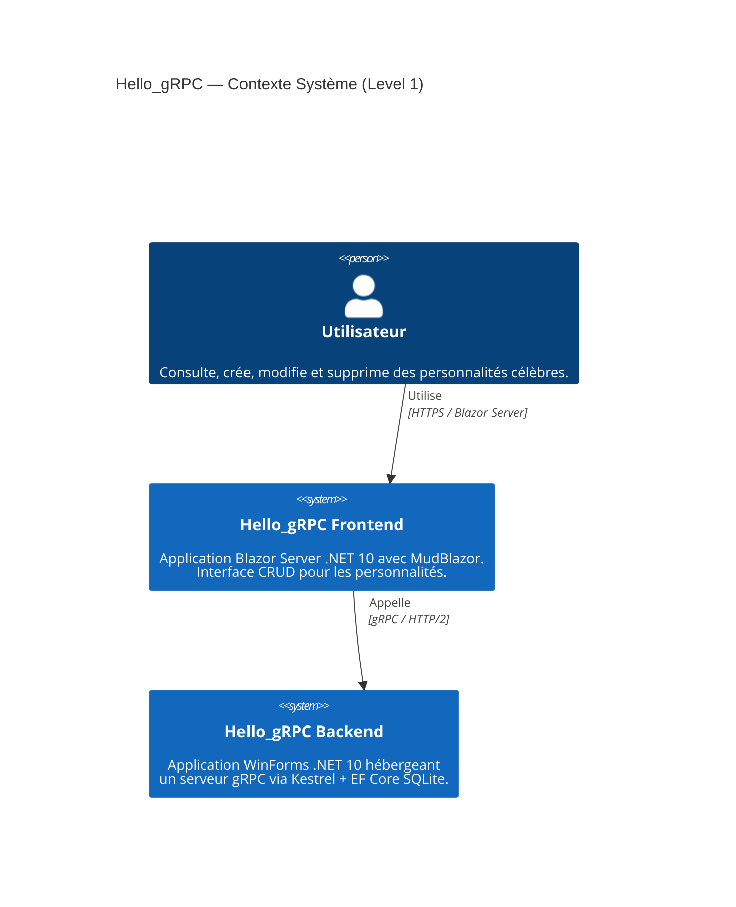
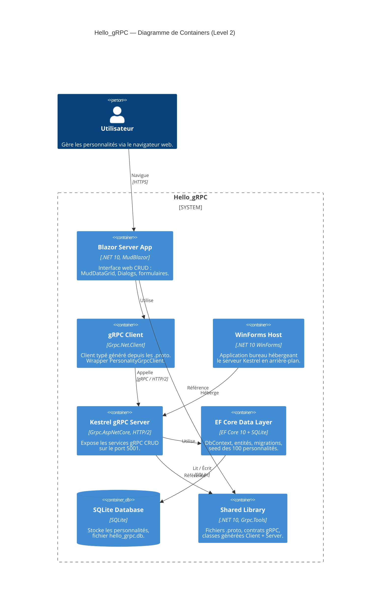
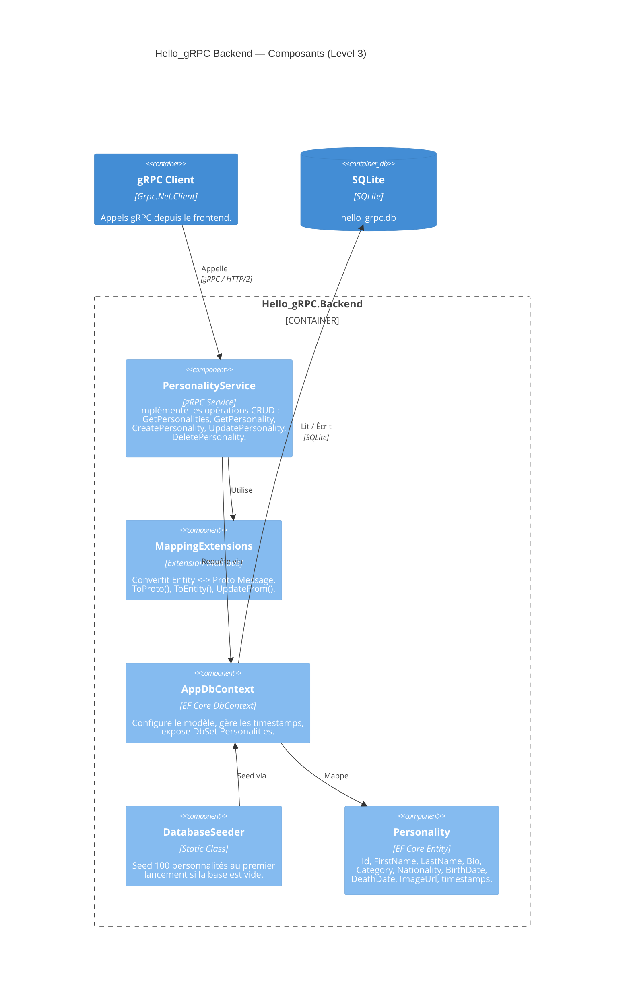
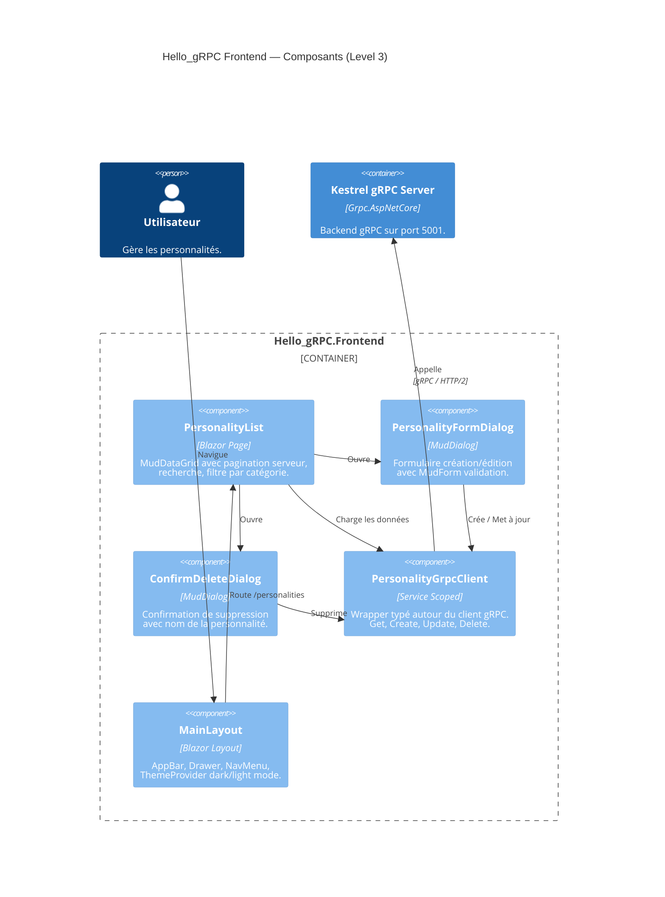
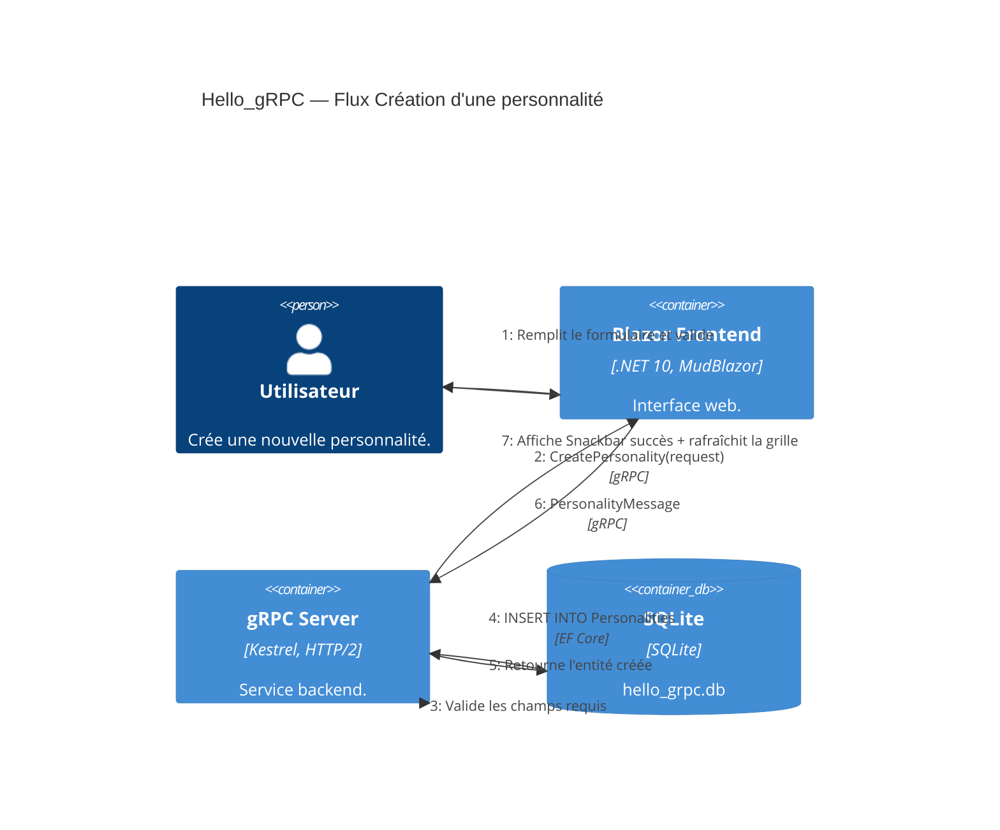
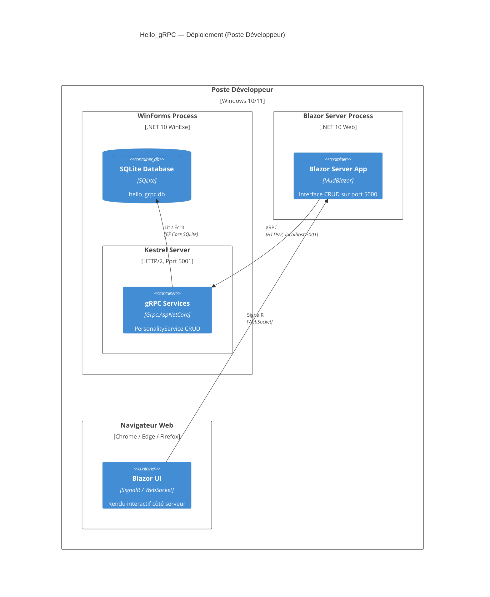

# Hello_gRPC — C4 Diagram Templates

Pre-built C4 diagrams for the Hello_gRPC project. Adapt and extend as the project evolves.

---

## Level 1 — System Context

---

## Level 2 — Container

---

## Level 3 — Component (Backend)

---

## Level 3 — Component (Frontend)

---

## Level 4 — Dynamic (CRUD Flow)

---

## Deployment

