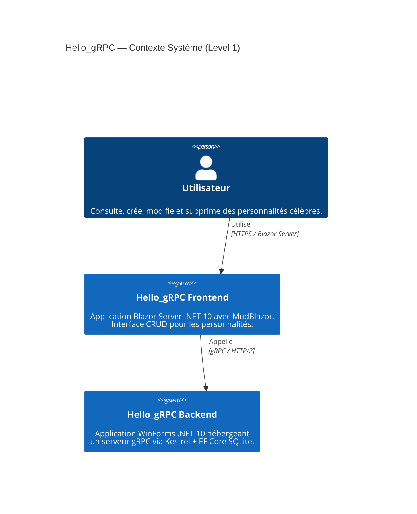
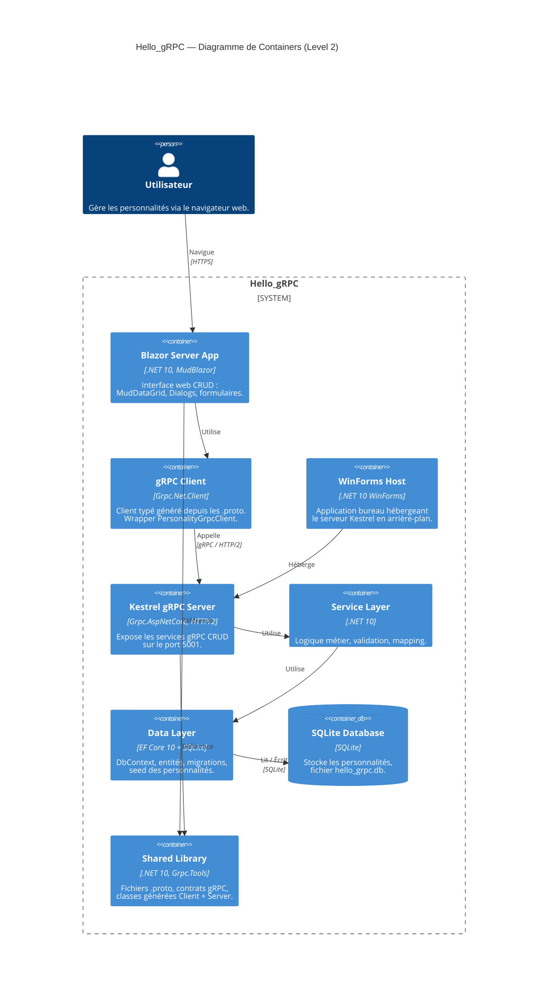
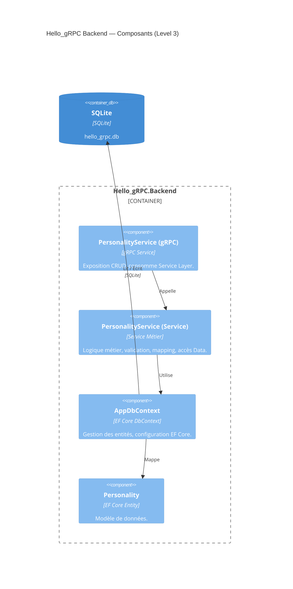
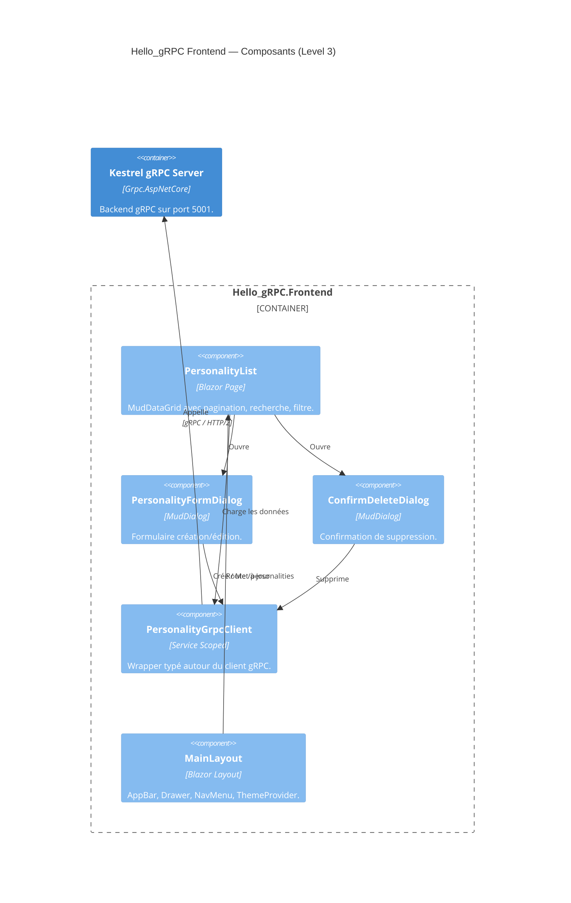
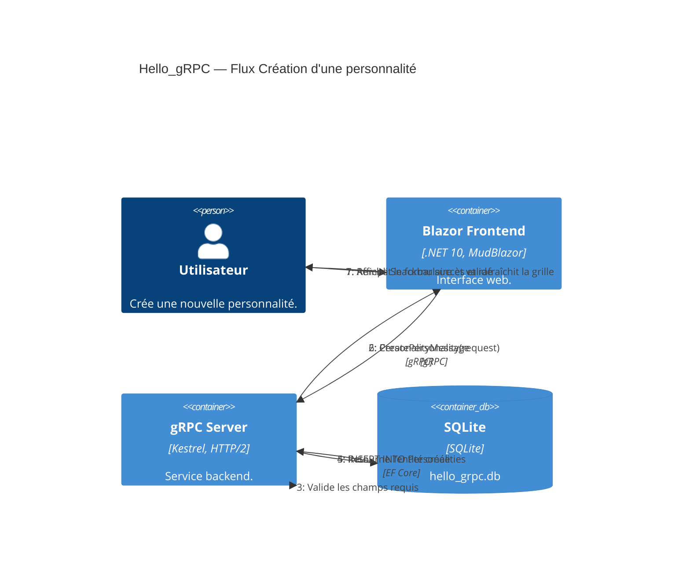
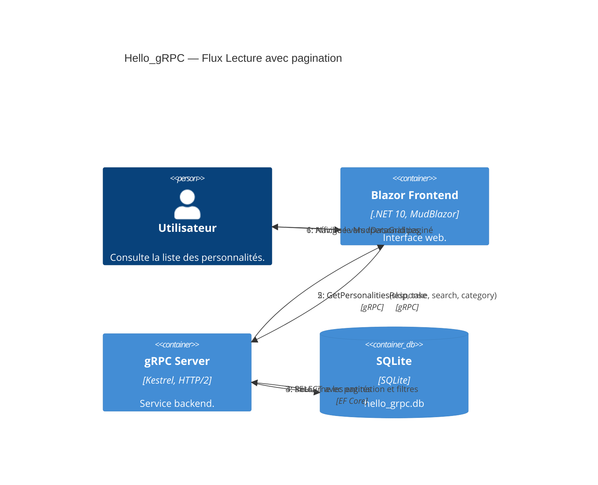
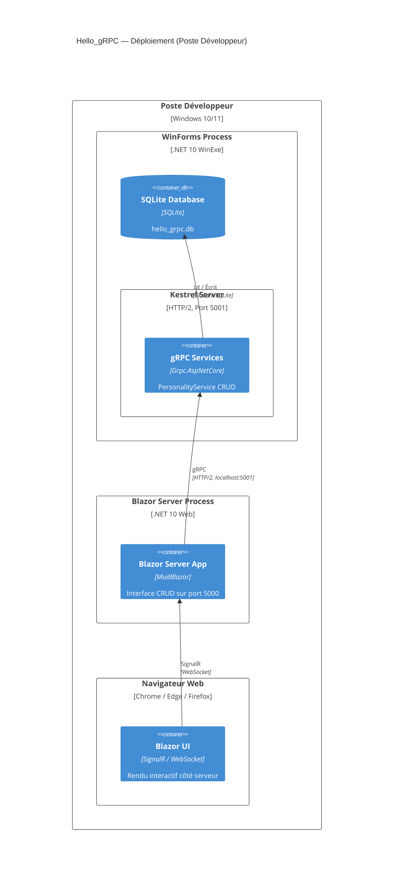

# Architecture Hello_gRPC — Documentation C4 (Mise à jour .NET 10)

> **Projet** : Hello_gRPC — Application CRUD fullstack de gestion de personnalités célèbres
> **Date** : Mars 2026
> **Stack** : .NET 10, gRPC, Blazor Server, MudBlazor, EF Core, SQLite, WinForms

---

## Table des matières

1. [Contexte Système (Level 1)](#1-contexte-système-level-1)
2. [Diagramme de Containers (Level 2)](#2-diagramme-de-containers-level-2)
3. [Diagramme de Composants — Backend (Level 3)](#3-diagramme-de-composants--backend-level-3)
4. [Diagramme de Composants — Frontend (Level 3)](#4-diagramme-de-composants--frontend-level-3)
5. [Diagramme Dynamique — Création (Level 4)](#5-diagramme-dynamique--création-level-4)
6. [Diagramme Dynamique — Lecture (Level 4)](#6-diagramme-dynamique--lecture-level-4)
7. [Diagramme de Déploiement](#7-diagramme-de-déploiement)

---

## 1. Contexte Système (Level 1)

Vue d'ensemble du système Hello_gRPC et de ses interactions avec l'utilisateur.

L'application se compose de deux systèmes principaux :
- **Frontend** : Application Blazor Server avec MudBlazor, accessible via navigateur web
- **Backend** : Application WinForms hébergeant un serveur gRPC via Kestrel avec persistance EF Core SQLite

L'utilisateur interagit uniquement avec le frontend. Le frontend communique avec le backend via gRPC sur HTTP/2.

---

## 2. Diagramme de Containers (Level 2)

Détail des containers applicatifs composant le système Hello_gRPC.

| Container | Technologie | Rôle |
|-----------|-------------|------|
| **Blazor Server App** | .NET 10, MudBlazor | Interface web CRUD (MudDataGrid, Dialogs, formulaires) |
| **gRPC Client** | Grpc.Net.Client | Client typé généré depuis les fichiers `.proto` |
| **WinForms Host** | .NET 10 WinForms | Application bureau hébergeant Kestrel en arrière-plan |
| **Kestrel gRPC Server** | Grpc.AspNetCore, HTTP/2 | Expose les services gRPC CRUD sur le port 5001 |
| **Service Layer** | .NET 10 | Logique métier, validation, mapping |
| **Data Layer** | EF Core 10 + SQLite | DbContext, entités, seed des personnalités |
| **SQLite Database** | SQLite | Fichier `hello_grpc.db` stockant les personnalités |
| **Shared Library** | .NET 10, Grpc.Tools | Fichiers `.proto`, contrats gRPC, classes générées |

---

## 3. Diagramme de Composants — Backend (Level 3)

Architecture interne du backend (WinForms + Kestrel + gRPC).

| Composant | Type | Responsabilité |
|-----------|------|----------------|
| **PersonalityService (gRPC)** | gRPC Service | Expose les opérations CRUD, consomme la couche Service |
| **PersonalityService (Service)** | Service Métier | Logique métier, validation, mapping, accès Data |
| **AppDbContext** | EF Core DbContext | Configuration du modèle, gestion des entités |
| **Personality** | EF Core Entity | Modèle de données |

---

## 4. Diagramme de Composants — Frontend (Level 3)

Architecture interne du frontend (Blazor Server).

| Composant | Type | Responsabilité |
|-----------|------|----------------|
| **MainLayout** | Blazor Layout | AppBar, Drawer, NavMenu, ThemeProvider |
| **PersonalityList** | Blazor Page | MudDataGrid paginé, recherche, filtre |
| **PersonalityFormDialog** | MudDialog | Formulaire création/édition |
| **ConfirmDeleteDialog** | MudDialog | Confirmation de suppression |
| **PersonalityGrpcClient** | Service Scoped | Wrapper typé autour du client gRPC |

---

## 5. Diagramme Dynamique — Création (Level 4)

Flux détaillé de la création d'une nouvelle personnalité.

---

## 6. Diagramme Dynamique — Lecture (Level 4)

Flux détaillé de la consultation de la liste des personnalités avec pagination et filtrage.

---

## 7. Diagramme de Déploiement

---
