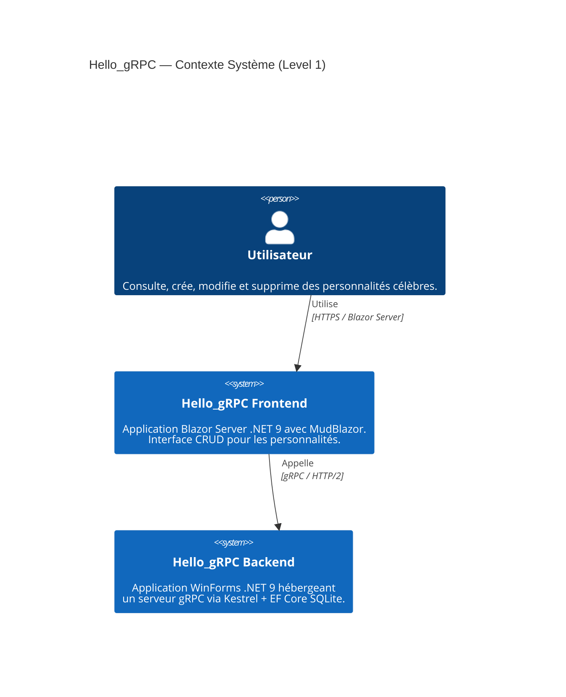
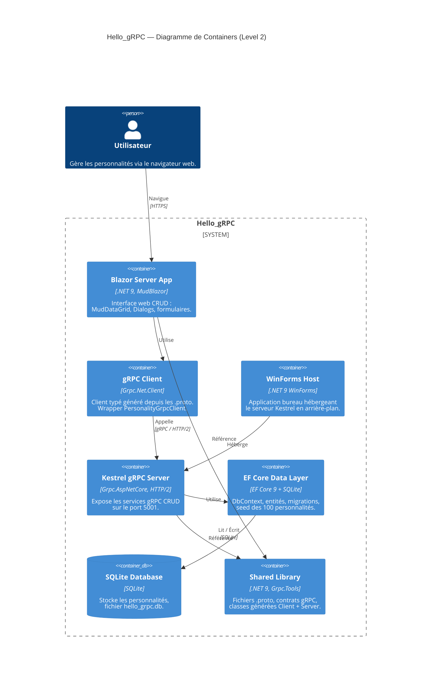
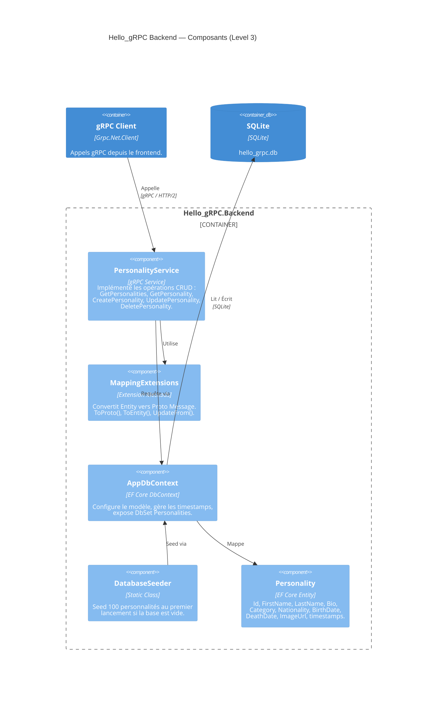
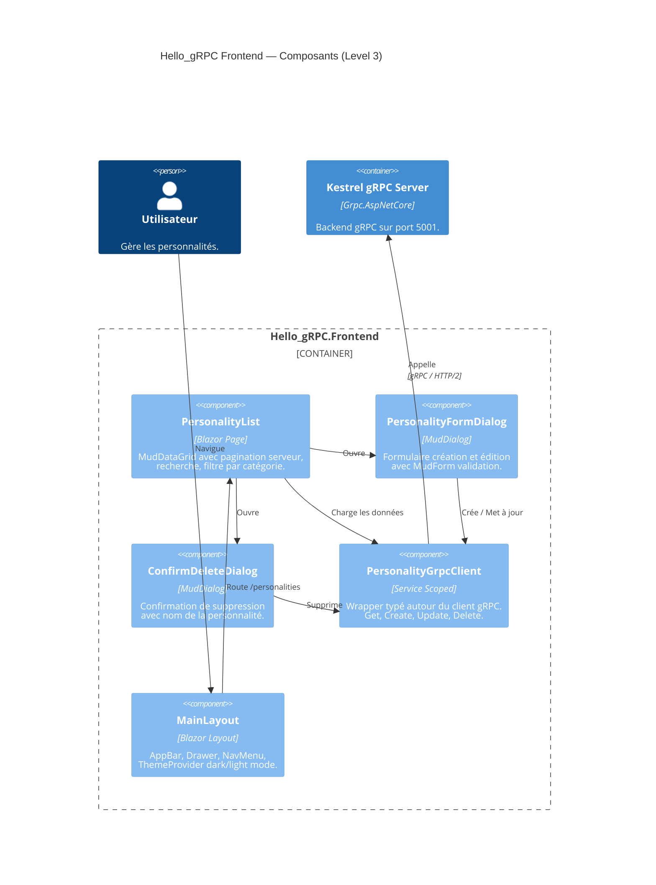
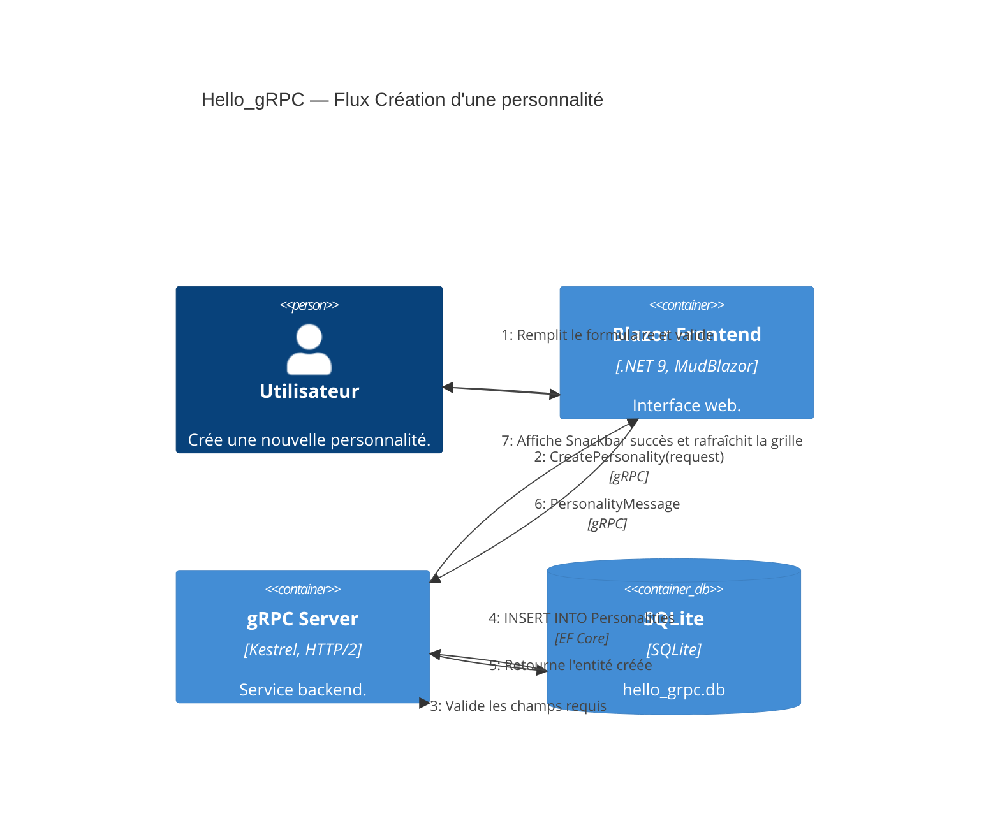
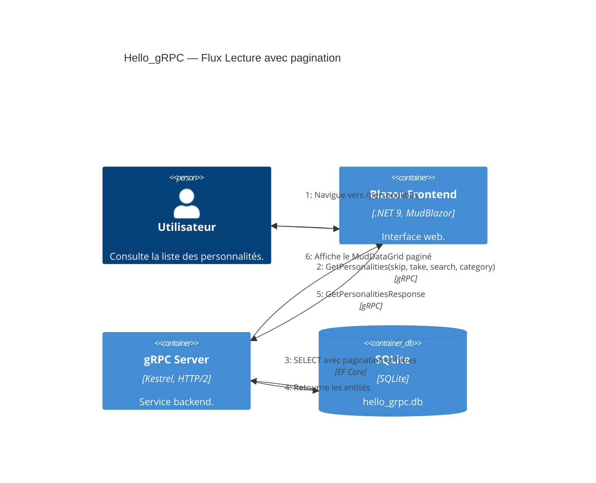
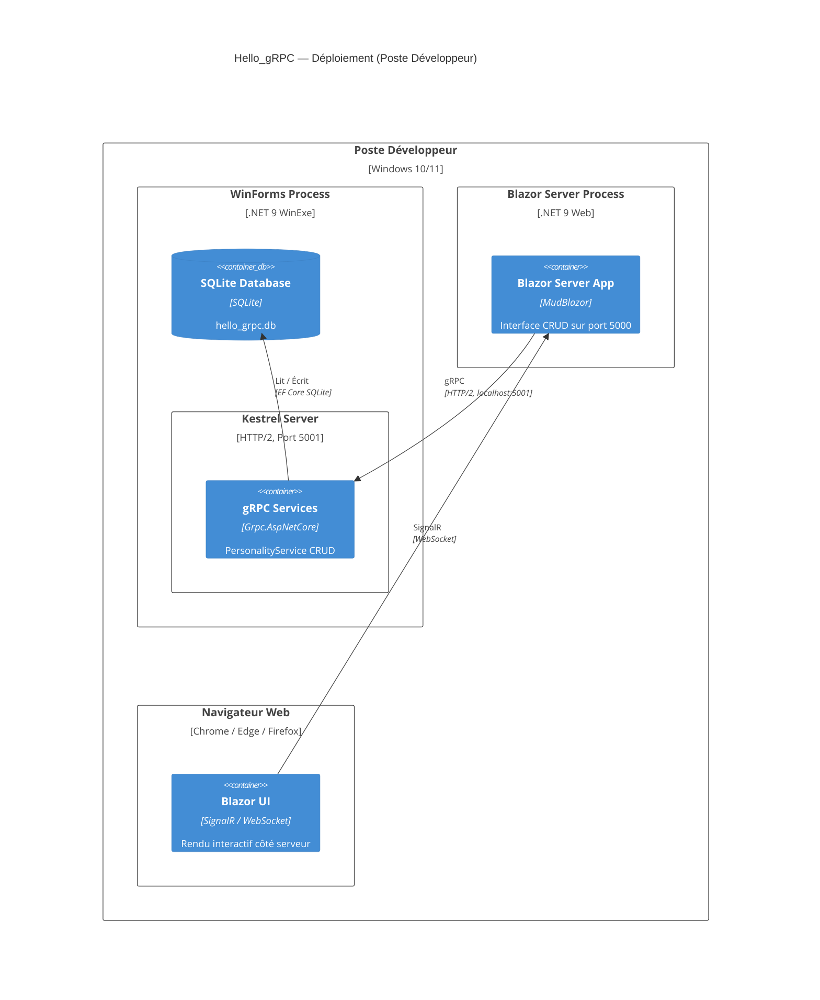

# Architecture Hello_gRPC — Documentation C4

> **Projet** : Hello_gRPC — Application CRUD fullstack de gestion de personnalités célèbres
> **Date** : Mars 2026
> **Stack** : .NET 9, gRPC, Blazor Server, MudBlazor, EF Core, SQLite, WinForms

---

## Table des matières

1. [Contexte Système (Level 1)](#1-contexte-système-level-1)
2. [Diagramme de Containers (Level 2)](#2-diagramme-de-containers-level-2)
3. [Diagramme de Composants — Backend (Level 3)](#3-diagramme-de-composants--backend-level-3)
4. [Diagramme de Composants — Frontend (Level 3)](#4-diagramme-de-composants--frontend-level-3)
5. [Diagramme Dynamique — Création (Level 4)](#5-diagramme-dynamique--création-level-4)
6. [Diagramme Dynamique — Lecture (Level 4)](#6-diagramme-dynamique--lecture-level-4)
7. [Diagramme de Déploiement](#7-diagramme-de-déploiement)

---

## 1. Contexte Système (Level 1)

Vue d'ensemble du système Hello_gRPC et de ses interactions avec l'utilisateur.

L'application se compose de deux systèmes principaux :
- **Frontend** : Application Blazor Server avec MudBlazor, accessible via navigateur web
- **Backend** : Application WinForms hébergeant un serveur gRPC via Kestrel avec persistance EF Core SQLite

L'utilisateur interagit uniquement avec le frontend. Le frontend communique avec le backend via gRPC sur HTTP/2.



---

## 2. Diagramme de Containers (Level 2)

Détail des containers applicatifs composant le système Hello_gRPC.

| Container | Technologie | Rôle |
|-----------|-------------|------|
| **Blazor Server App** | .NET 9, MudBlazor | Interface web CRUD (MudDataGrid, Dialogs, formulaires) |
| **gRPC Client** | Grpc.Net.Client | Client typé généré depuis les fichiers `.proto` |
| **WinForms Host** | .NET 9 WinForms | Application bureau hébergeant Kestrel en arrière-plan |
| **Kestrel gRPC Server** | Grpc.AspNetCore, HTTP/2 | Expose les services gRPC CRUD sur le port 5001 |
| **EF Core Data Layer** | EF Core 9 + SQLite | DbContext, entités, seed des 100 personnalités |
| **SQLite Database** | SQLite | Fichier `hello_grpc.db` stockant les personnalités |
| **Shared Library** | .NET 9, Grpc.Tools | Fichiers `.proto`, contrats gRPC, classes générées |



---

## 3. Diagramme de Composants — Backend (Level 3)

Architecture interne du projet `Hello_gRPC.Backend`.

| Composant | Type | Responsabilité |
|-----------|------|----------------|
| **PersonalityService** | gRPC Service | CRUD complet : Get, Create, Update, Delete avec validation |
| **MappingExtensions** | Extension Methods | Conversion bidirectionnelle Entity ↔ Proto Message |
| **AppDbContext** | EF Core DbContext | Configuration du modèle, gestion des timestamps, DbSet |
| **DatabaseSeeder** | Static Class | Seed de 100 personnalités au premier lancement |
| **Personality** | EF Core Entity | Modèle de données avec 10 propriétés + timestamps |



---

## 4. Diagramme de Composants — Frontend (Level 3)

Architecture interne du projet `Hello_gRPC.Frontend`.

| Composant | Type | Responsabilité |
|-----------|------|----------------|
| **MainLayout** | Blazor Layout | AppBar, Drawer, NavMenu, ThemeProvider dark/light |
| **PersonalityList** | Blazor Page | MudDataGrid paginé, recherche, filtre catégorie |
| **PersonalityFormDialog** | MudDialog | Formulaire création/édition avec validation |
| **ConfirmDeleteDialog** | MudDialog | Confirmation de suppression |
| **PersonalityGrpcClient** | Service Scoped | Wrapper typé autour du client gRPC généré |



---

## 5. Diagramme Dynamique — Création (Level 4)

Flux détaillé de la création d'une nouvelle personnalité.

**Scénario** : L'utilisateur ouvre le formulaire, remplit les champs et valide la création.

1. L'utilisateur remplit le formulaire `PersonalityFormDialog` et clique « Créer »
2. Le frontend appelle `CreatePersonality(request)` via gRPC
3. Le backend valide les champs requis (prénom, nom, bio, catégorie)
4. EF Core insère la nouvelle entité dans SQLite
5. L'entité créée est retournée en `PersonalityMessage`
6. Le frontend affiche un Snackbar de succès et rafraîchit le MudDataGrid



---

## 6. Diagramme Dynamique — Lecture (Level 4)

Flux détaillé de la consultation de la liste des personnalités avec pagination et filtrage.

**Scénario** : L'utilisateur navigue vers `/personalities`, saisit un terme de recherche ou sélectionne une catégorie.

1. L'utilisateur navigue vers la page `/personalities`
2. Le MudDataGrid appelle `GetPersonalities` avec les paramètres de pagination et filtrage
3. EF Core exécute la requête SQL avec `WHERE`, `ORDER BY`, `SKIP`, `TAKE`
4. Les entités sont converties en messages Proto via `MappingExtensions`
5. La réponse contient la liste paginée et le total count
6. Le MudDataGrid affiche les résultats avec le pager



---

## 7. Diagramme de Déploiement

Architecture de déploiement sur un poste développeur Windows.

| Processus | Port | Rôle |
|-----------|------|------|
| **WinForms Process** | 5001 | Héberge Kestrel gRPC Server + SQLite |
| **Blazor Server Process** | 5000 | Sert l'interface web Blazor |
| **Navigateur** | — | Rendu interactif via SignalR/WebSocket |



---

## Structure de la solution

```
Hello_gRPC.sln
├── src/
│   ├── Hello_gRPC.Shared/
│   │   ├── Protos/
│   │   │   └── personality.proto          # Contrat gRPC CRUD
│   │   └── GlobalUsings.cs
│   ├── Hello_gRPC.Backend/
│   │   ├── Data/
│   │   │   ├── AppDbContext.cs            # EF Core DbContext + SQLite
│   │   │   └── DatabaseSeeder.cs          # Seed 100 personnalités
│   │   ├── Entities/
│   │   │   └── Personality.cs             # Entité EF Core
│   │   ├── Extensions/
│   │   │   └── MappingExtensions.cs       # Entity ↔ Proto mapping
│   │   ├── Services/
│   │   │   └── PersonalityService.cs      # gRPC CRUD service
│   │   ├── MainForm.cs                    # WinForms UI
│   │   ├── Program.cs                     # WinForms + Kestrel host
│   │   └── GlobalUsings.cs
│   └── Hello_gRPC.Frontend/
│       ├── Components/
│       │   ├── App.razor                  # Root component
│       │   ├── Routes.razor               # Router
│       │   ├── _Imports.razor             # Global directives
│       │   ├── Layout/
│       │   │   ├── MainLayout.razor       # MudBlazor layout + dark mode
│       │   │   └── NavMenu.razor          # Navigation
│       │   ├── Pages/
│       │   │   ├── Home.razor             # Page d'accueil
│       │   │   └── Personalities/
│       │   │       └── PersonalityList.razor  # CRUD DataGrid
│       │   └── Dialogs/
│       │       ├── PersonalityFormDialog.razor # Create/Edit form
│       │       └── ConfirmDeleteDialog.razor   # Delete confirmation
│       ├── Services/
│       │   └── PersonalityGrpcClient.cs   # gRPC client wrapper
│       ├── Program.cs                     # Blazor + MudBlazor + gRPC client
│       └── GlobalUsings.cs
└── docs/
    └── architecture-c4.md                 # Ce document
```

---

## Technologies et versions

| Composant | Package | Version |
|-----------|---------|---------|
| Runtime | .NET | 9.0 |
| gRPC Server | Grpc.AspNetCore | 2.x |
| gRPC Client | Grpc.Net.Client | 2.x |
| gRPC Tooling | Grpc.Tools | 2.x |
| Protobuf | Google.Protobuf | 3.x |
| ORM | Microsoft.EntityFrameworkCore.Sqlite | 9.x |
| UI Framework | MudBlazor | 8.x |
| Frontend | Blazor Server | .NET 9 |
| Backend Host | WinForms | .NET 9 |

---

## Catégories de personnalités

L'application est pré-chargée avec **100 personnalités** réparties en 10 catégories :

| # | Catégorie | Exemples |
|---|-----------|----------|
| 1 | Science | Albert Einstein, Marie Curie, Isaac Newton |
| 2 | Art | Leonardo da Vinci, Pablo Picasso, Frida Kahlo |
| 3 | Politique | Nelson Mandela, Winston Churchill, Angela Merkel |
| 4 | Sport | Muhammad Ali, Pelé, Serena Williams |
| 5 | Littérature | William Shakespeare, Victor Hugo, Toni Morrison |
| 6 | Musique | Ludwig van Beethoven, Bob Marley, Édith Piaf |
| 7 | Cinéma | Charlie Chaplin, Alfred Hitchcock, Meryl Streep |
| 8 | Philosophie | Socrate, René Descartes, Simone de Beauvoir |
| 9 | Histoire | Jules César, Napoléon Bonaparte, Cléopâtre |
| 10 | Technologie | Alan Turing, Ada Lovelace, Steve Jobs |