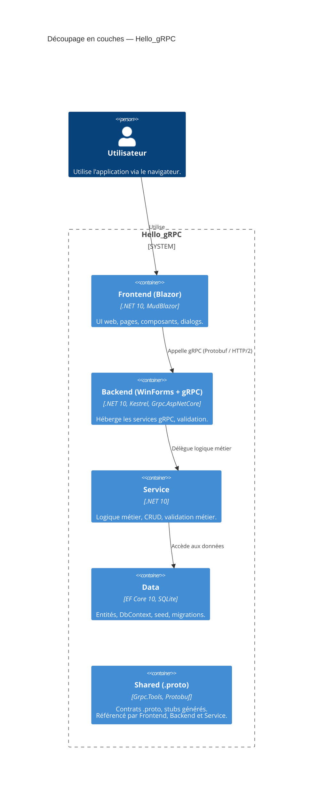
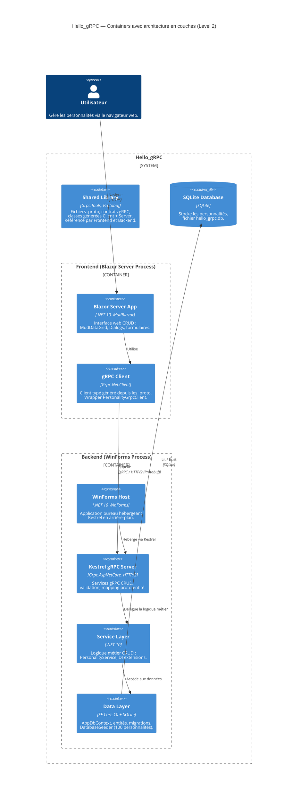
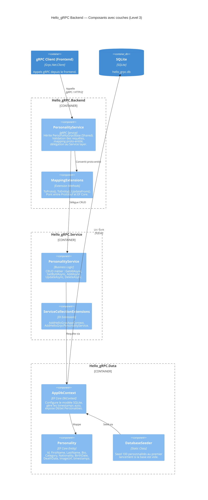
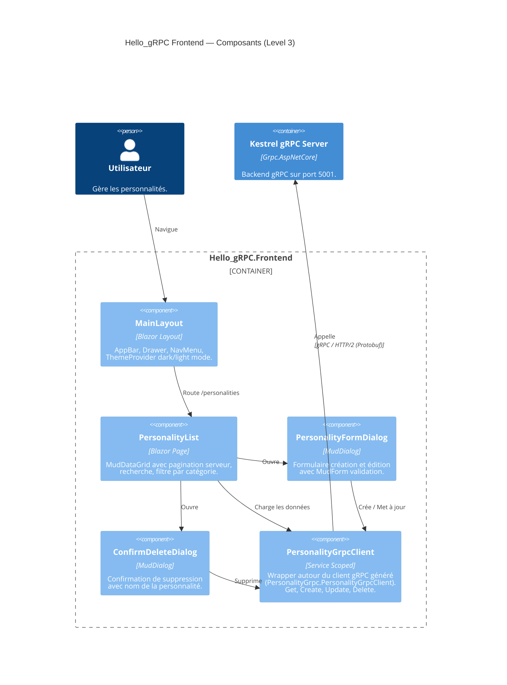
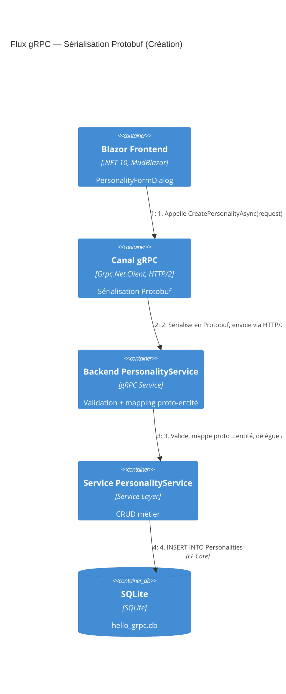
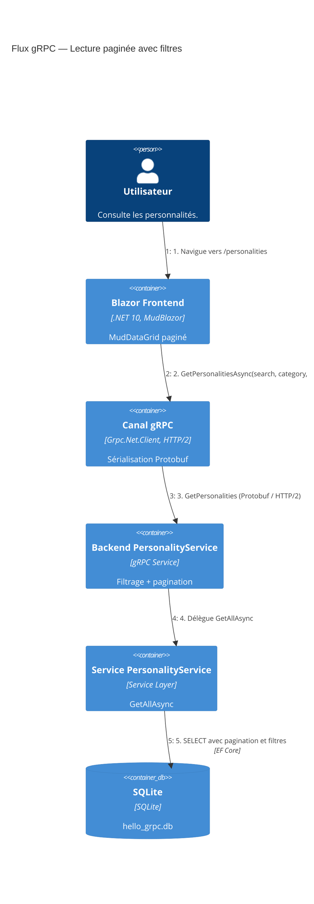
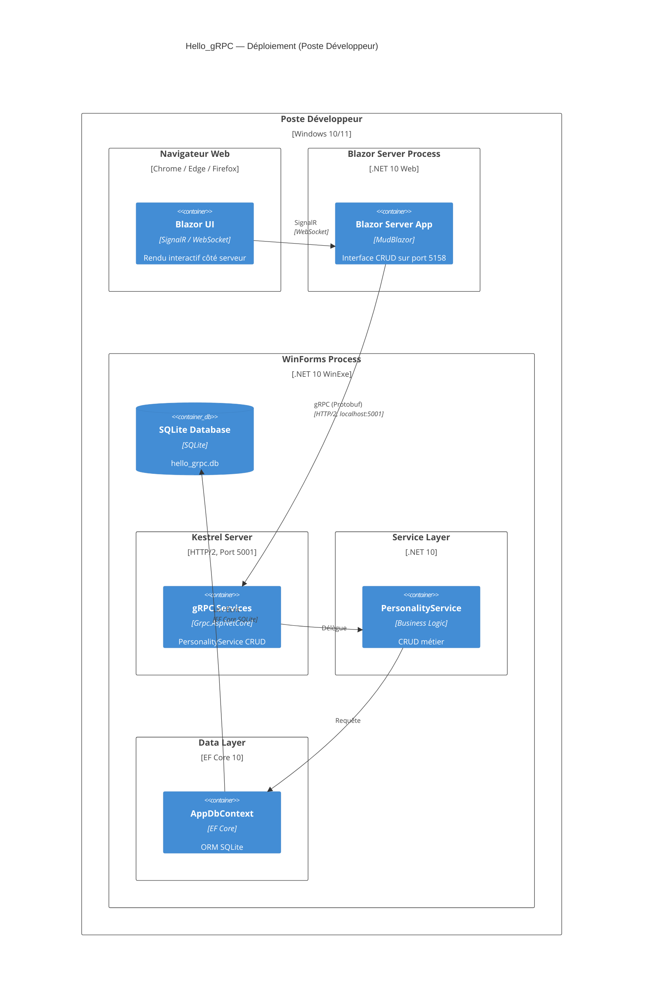

# Architecture Hello_gRPC — Documentation C4

> **Projet** : Hello_gRPC — Application CRUD fullstack de gestion de personnalités célèbres
> **Date** : Mars 2026
> **Stack** : .NET 10, gRPC (Protobuf), Blazor Server, MudBlazor, EF Core 10, SQLite, WinForms

---

## Table des matières

1. [Vue d'ensemble — Architecture en couches](#1-vue-densemble--architecture-en-couches)
2. [gRPC et Protocol Buffers — Le cœur de la communication](#2-grpc-et-protocol-buffers--le-cœur-de-la-communication)
   - [Pourquoi gRPC ?](#pourquoi-grpc-)
   - [Le rôle central des fichiers .proto](#le-rôle-central-des-fichiers-proto)
   - [Anatomie du fichier personality.proto](#anatomie-du-fichier-personalityproto)
   - [De .proto à C# — La génération de code](#de-proto-à-c--la-génération-de-code)
   - [Sérialisation Protobuf — Format binaire](#sérialisation-protobuf--format-binaire)
   - [HTTP/2 — Le transport de gRPC](#http2--le-transport-de-grpc)
3. [Contexte Système — Level 1](#3-contexte-système--level-1)
4. [Diagramme de Containers — Level 2](#4-diagramme-de-containers--level-2)
5. [Diagramme de Composants — Backend — Level 3](#5-diagramme-de-composants--backend--level-3)
6. [Diagramme de Composants — Frontend — Level 3](#6-diagramme-de-composants--frontend--level-3)
7. [Diagramme Dynamique — Création avec sérialisation Protobuf — Level 4](#7-diagramme-dynamique--création-avec-sérialisation-protobuf--level-4)
8. [Diagramme Dynamique — Lecture paginée — Level 4](#8-diagramme-dynamique--lecture-paginée--level-4)
9. [Diagramme de Déploiement](#9-diagramme-de-déploiement)
10. [Schéma du pipeline gRPC complet](#10-schéma-du-pipeline-grpc-complet)
11. [Structure de la solution](#11-structure-de-la-solution)
12. [Annexe — Correspondances .proto ↔ C#](#12-annexe--correspondances-proto--c)

---

## 1. Vue d'ensemble — Architecture en couches

La solution Hello_gRPC suit une **architecture en couches** stricte, chaque projet ayant un rôle précis et des dépendances contrôlées :

| Couche | Projet | Namespace | Responsabilité |
|--------|--------|-----------|----------------|
| **Shared** | `Hello_gRPC.Shared` | `HelloGrpc.Shared` | Fichiers `.proto`, contrats gRPC, classes C# générées (messages + stubs client/serveur) |
| **Data** | `Hello_gRPC.Data` | `HelloGrpc.Data` | Entités EF Core, `AppDbContext`, migrations SQLite, `DatabaseSeeder` |
| **Service** | `Hello_gRPC.Service` | `HelloGrpc.Service` | Logique métier CRUD (`PersonalityService`), extensions DI |
| **Backend** | `Hello_gRPC.Backend` | `HelloGrpc.Backend` | Hôte WinForms + Kestrel, services gRPC (implémentation `PersonalityGrpcBase`), mapping proto ↔ entité |
| **Frontend** | `Hello_gRPC.Frontend` | `HelloGrpc.Frontend` | Blazor Server + MudBlazor, client gRPC typé, pages CRUD |

### Graphe de dépendances

```
Shared ← Data ← Service ← Backend
Shared ←―――――――――――――――――← Frontend
```

> **Point clé** : Le projet **Shared** est la **source unique de vérité** pour les contrats d'API. Grâce aux fichiers `.proto`, les deux extrémités de la communication (Backend et Frontend) utilisent exactement les mêmes messages et méthodes, sans aucune duplication de code.



---

## 2. gRPC et Protocol Buffers — Le cœur de la communication

### Pourquoi gRPC ?

gRPC (*gRPC Remote Procedure Call*) est un framework open-source développé par Google qui permet la communication entre services de manière performante et fortement typée.

| Caractéristique | gRPC | REST (JSON) |
|----------------|------|-------------|
| **Format de sérialisation** | Protocol Buffers (binaire) | JSON (texte) |
| **Taille des messages** | ~3-10x plus compact | Verbeux (clés texte répétées) |
| **Performance** | Très rapide (binaire, pas de parsing texte) | Plus lent (parsing JSON) |
| **Contrat d'API** | Fortement typé via `.proto` | Conventions (OpenAPI optionnel) |
| **Génération de code** | Automatique (client + serveur) | Manuelle ou via outils tiers |
| **Transport** | HTTP/2 (multiplexage, streams) | HTTP/1.1 ou HTTP/2 |
| **Streaming** | Bidirectionnel natif | Non natif (SSE, WebSocket) |
| **Validation de structure** | Au compile-time via `.proto` | Au runtime uniquement |

Dans Hello_gRPC, le choix de gRPC apporte :
- **Typage fort** : Le compilateur C# détecte les erreurs de contrat avant l'exécution
- **Performance** : Messages binaires compacts entre Frontend et Backend
- **Synchronisation** : Un seul fichier `.proto` génère client ET serveur — impossible de désynchroniser l'API
- **Productivité** : Les stubs gRPC sont générés automatiquement, pas de code HTTP plombier à écrire

### Le rôle central des fichiers .proto

Le fichier `.proto` est le **contrat d'interface** qui définit :
1. **Le service** : Quelles opérations sont disponibles (RPC methods)
2. **Les messages** : La structure exacte des données échangées
3. **Les types** : Le typage fort de chaque champ

```
┌──────────────────────────────────────────────────────────────┐
│                    personality.proto                          │
│                  (Source unique de vérité)                    │
├──────────────────────────────────────────────────────────────┤
│                                                              │
│  ┌─────────────────────┐    ┌──────────────────────────────┐ │
│  │  Service Definition │    │  Message Definitions         │ │
│  │                     │    │                              │ │
│  │  PersonalityGrpc    │    │  PersonalityMessage          │ │
│  │  ├─ GetPersonalities│    │  GetPersonalitiesRequest     │ │
│  │  ├─ GetPersonality  │    │  GetPersonalitiesResponse    │ │
│  │  ├─ CreatePersonality│   │  GetPersonalityRequest       │ │
│  │  ├─ UpdatePersonality│   │  CreatePersonalityRequest    │ │
│  │  └─ DeletePersonality│   │  UpdatePersonalityRequest    │ │
│  └─────────────────────┘    │  DeletePersonalityRequest    │ │
│                             │  DeletePersonalityResponse   │ │
│                             └──────────────────────────────┘ │
└──────────────────┬──────────────────────┬────────────────────┘
                   │  Grpc.Tools compile  │
          ┌────────▼────────┐   ┌─────────▼─────────┐
          │  Côté Serveur   │   │   Côté Client      │
          │                 │   │                     │
          │ PersonalityGrpc │   │ PersonalityGrpc     │
          │ .PersonalityGrpc│   │ .PersonalityGrpc    │
          │  Base            │   │  Client             │
          │ (classe abstraite│   │ (client typé prêt   │
          │  à implémenter)  │   │  à appeler)         │
          └────────┬────────┘   └─────────┬───────────┘
                   │                      │
          ┌────────▼────────┐   ┌─────────▼──────────────┐
          │ Hello_gRPC      │   │ Hello_gRPC             │
          │ .Backend        │   │ .Frontend              │
          │                 │   │                         │
          │ PersonalityService│ │ PersonalityGrpcClient   │
          │ : PersonalityGrpc│  │ (wrapper autour du      │
          │   Base           │  │  client généré)         │
          └─────────────────┘   └─────────────────────────┘
```

> **Principe fondamental** : Modifier le `.proto` suffit pour propager un changement d'API à l'ensemble de la solution. Le compilateur signalera toute implémentation non conforme.

### Anatomie du fichier personality.proto

```protobuf
// 1. Syntaxe — Toujours proto3
syntax = "proto3";

// 2. Namespace C# — Contrôle le namespace des classes générées
option csharp_namespace = "HelloGrpc.Shared";

// 3. Package — Identifiant logique du service
package personality;

// 4. Service — Définit les 5 opérations CRUD
service PersonalityGrpc {
  rpc GetPersonalities (GetPersonalitiesRequest) returns (GetPersonalitiesResponse);
  rpc GetPersonality (GetPersonalityRequest) returns (PersonalityMessage);
  rpc CreatePersonality (CreatePersonalityRequest) returns (PersonalityMessage);
  rpc UpdatePersonality (UpdatePersonalityRequest) returns (PersonalityMessage);
  rpc DeletePersonality (DeletePersonalityRequest) returns (DeletePersonalityResponse);
}

// 5. Messages — Structures de données typées
message PersonalityMessage {
  int32 id = 1;              // Chaque champ a un numéro unique (tag)
  string first_name = 2;     // Les tags sont utilisés dans le format binaire
  string last_name = 3;      // Convention : snake_case pour les noms de champs
  string bio = 4;
  string category = 5;
  string nationality = 6;
  string birth_date = 7;
  string death_date = 8;
  string image_url = 9;
}

message GetPersonalitiesRequest {
  string search_term = 1;    // Filtre textuel
  string category = 2;       // Filtre par catégorie
  int32 skip = 3;            // Pagination : offset
  int32 take = 4;            // Pagination : page size
}

message GetPersonalitiesResponse {
  repeated PersonalityMessage personalities = 1;  // repeated = liste/collection
  int32 total_count = 2;                          // Total pour la pagination
}
```

#### Éléments clés du fichier .proto

| Élément | Rôle | Exemple |
|---------|------|---------|
| `syntax = "proto3"` | Version du langage Protobuf | Obligatoire en première ligne |
| `option csharp_namespace` | Namespace des classes C# générées | `"HelloGrpc.Shared"` |
| `package` | Namespace logique Protobuf | `personality` |
| `service` | Définition du service RPC | `PersonalityGrpc` |
| `rpc` | Méthode d'appel à distance | `rpc GetPersonality(Req) returns (Resp)` |
| `message` | Structure de données | `PersonalityMessage` |
| `int32`, `string`, `bool` | Types scalaires Protobuf | Mappés vers `int`, `string`, `bool` en C# |
| `repeated` | Collection/liste d'éléments | `repeated PersonalityMessage` → `RepeatedField<T>` |
| Numéros de champs (`= 1`, `= 2`...) | Tags binaires uniques | Utilisés pour la sérialisation, **ne jamais les réutiliser** |

#### Règles de numérotation des champs

Les numéros de champs sont **critiques** pour la compatibilité binaire :
- Chaque champ a un numéro unique **permanent** (tag)
- Les tags 1–15 utilisent 1 octet → à réserver aux champs les plus fréquents
- Les tags 16–2047 utilisent 2 octets
- **Ne jamais réutiliser** un numéro de champ supprimé (compatibilité arrière)
- **Ne jamais changer** le numéro d'un champ existant

### De .proto à C# — La génération de code

Le package NuGet **Grpc.Tools** compile automatiquement les fichiers `.proto` en classes C# lors du `dotnet build`. Voici ce qui est généré :

```xml
<!-- Hello_gRPC.Shared.csproj -->
<ItemGroup>
  <Protobuf Include="Protos\personality.proto" GrpcServices="Both" />
</ItemGroup>
```

Le paramètre `GrpcServices="Both"` génère **à la fois** le code client et le code serveur :

| Classe générée | Rôle | Utilisée par |
|---------------|------|-------------|
| `PersonalityGrpc.PersonalityGrpcBase` | Classe abstraite serveur avec les 5 méthodes `override` | Backend |
| `PersonalityGrpc.PersonalityGrpcClient` | Client typé avec les 5 méthodes async | Frontend |
| `PersonalityMessage` | Classe C# du message | Backend + Frontend |
| `GetPersonalitiesRequest` | Classe C# de la requête | Backend + Frontend |
| `GetPersonalitiesResponse` | Classe C# de la réponse | Backend + Frontend |
| *(et toutes les autres messages...)* | | |

#### Ce que le développeur écrit vs ce qui est généré

```
┌─────────────────────────────────┐
│  Ce que le développeur écrit :  │
│                                 │
│  1. personality.proto (contrat) │
│  2. Backend: PersonalityService │
│     : PersonalityGrpcBase       │
│     (override des 5 méthodes)   │
│  3. Frontend: PersonalityGrpc   │
│     Client (wrapper)            │
└─────────────┬───────────────────┘
              │
   dotnet build (Grpc.Tools)
              │
┌─────────────▼───────────────────┐
│  Ce qui est généré :            │
│                                 │
│  • PersonalityGrpcBase          │
│    (classe abstraite serveur)   │
│  • PersonalityGrpcClient        │
│    (client typé prêt à l'emploi)│
│  • Toutes les classes de        │
│    messages (sérialisation      │
│    Protobuf incluse)            │
│  • Méthodes Serialize /         │
│    Deserialize                  │
│  • Métadonnées de réflexion     │
└─────────────────────────────────┘
```

### Sérialisation Protobuf — Format binaire

Protocol Buffers utilise un format **binaire compact** fondamentalement différent de JSON :

#### Comparaison JSON vs Protobuf

```json
// JSON (~180 octets en texte)
{
  "id": 1,
  "first_name": "Albert",
  "last_name": "Einstein",
  "bio": "Physicien théoricien, père de la relativité.",
  "category": "Science",
  "nationality": "Allemagne",
  "birth_date": "1879-03-14",
  "death_date": "1955-04-18",
  "image_url": ""
}
```

```
// Protobuf (~100 octets en binaire)
// Chaque champ est encodé comme : [tag + wire_type] [longueur] [données]
08 01                          → champ 1 (id), varint: 1
12 06 41 6C 62 65 72 74       → champ 2 (first_name), string: "Albert"
1A 08 45 69 6E 73 74 65 69 6E → champ 3 (last_name), string: "Einstein"
22 2C 50 68 79 73 69 63 ...   → champ 4 (bio), string: "Physicien..."
...
```

#### Principes de l'encodage Protobuf

| Concept | Description |
|---------|-------------|
| **Wire Type 0** (Varint) | Entiers à taille variable (`int32`, `bool`) — les petites valeurs prennent moins d'octets |
| **Wire Type 2** (Length-delimited) | Strings, bytes, messages imbriqués — préfixés par leur longueur |
| **Pas de noms de champs** | Seul le numéro de tag est transmis → gains de taille considérables |
| **Champs absents** | Les champs avec valeur par défaut (`""`, `0`, `false`) ne sont pas transmis |
| **Ordre non garanti** | Les champs peuvent arriver dans n'importe quel ordre |

> **Gain typique** : Un message Protobuf est **3 à 10 fois plus petit** que son équivalent JSON, et la sérialisation/désérialisation est **5 à 100 fois plus rapide** (pas de parsing texte).

### HTTP/2 — Le transport de gRPC

gRPC utilise **HTTP/2** comme protocole de transport, ce qui apporte des avantages majeurs par rapport à HTTP/1.1 :

```
┌──────────────────────────────────────────────────────────────┐
│                    HTTP/2 Connection                          │
│              (une seule connexion TCP)                        │
│                                                              │
│  ┌─────────────┐  ┌─────────────┐  ┌─────────────┐         │
│  │  Stream #1   │  │  Stream #3   │  │  Stream #5   │        │
│  │ GetPersonality│ │CreatePerson. │  │GetPersonalities│      │
│  │              │  │              │  │              │         │
│  │  HEADERS     │  │  HEADERS     │  │  HEADERS     │        │
│  │  DATA (req)  │  │  DATA (req)  │  │  DATA (req)  │        │
│  │  HEADERS     │  │  HEADERS     │  │  HEADERS     │        │
│  │  DATA (resp) │  │  DATA (resp) │  │  DATA (resp) │        │
│  └─────────────┘  └─────────────┘  └─────────────┘         │
│                                                              │
│  Multiplexage : plusieurs appels gRPC simultanés             │
│  sur la même connexion TCP                                   │
└──────────────────────────────────────────────────────────────┘
```

| Fonctionnalité HTTP/2 | Bénéfice pour gRPC |
|----------------------|-------------------|
| **Multiplexage** | Plusieurs RPC en parallèle sur une connexion |
| **Frames binaires** | Framing efficace des messages Protobuf |
| **Header compression** (HPACK) | Réduction de l'overhead des métadonnées |
| **Server push** | Base pour le streaming bidirectionnel |
| **Flow control** | Contrôle de débit par stream |

#### Configuration Kestrel pour HTTP/2 dans Hello_gRPC

```csharp
// Program.cs du Backend
builder.WebHost.ConfigureKestrel(options =>
{
    // Port gRPC — HTTP/2 obligatoire pour gRPC
    options.ListenLocalhost(5001, listenOptions =>
    {
        listenOptions.Protocols = HttpProtocols.Http2;
    });
    // Port REST auxiliaire — HTTP/1.1
    options.ListenLocalhost(5002, listenOptions =>
    {
        listenOptions.Protocols = HttpProtocols.Http1;
    });
});
```

---

## 3. Contexte Système — Level 1

Vue d'ensemble du système Hello_gRPC et de ses interactions avec l'utilisateur.

L'application se compose de deux processus principaux communiquant via **gRPC sur HTTP/2** :
- **Frontend** : Application Blazor Server avec MudBlazor, accessible via navigateur web
- **Backend** : Application WinForms hébergeant un serveur gRPC via Kestrel, avec une architecture en couches (Data → Service → Backend)

L'utilisateur interagit uniquement avec le frontend. Le frontend communique avec le backend exclusivement via des appels gRPC sérialisés en **Protobuf binaire**.


---

## 4. Diagramme de Containers — Level 2

Détail des containers applicatifs composant le système Hello_gRPC, mettant en évidence le rôle central de la **Shared Library** (`.proto`) et l'architecture en couches du backend.

| Container | Projet | Technologie | Rôle |
|-----------|--------|-------------|------|
| **Blazor Server App** | `Hello_gRPC.Frontend` | .NET 10, MudBlazor | Interface web CRUD (MudDataGrid, Dialogs, formulaires) |
| **gRPC Client** | `Hello_gRPC.Frontend` | Grpc.Net.Client | Client gRPC typé généré depuis les `.proto` |
| **Shared Library** | `Hello_gRPC.Shared` | Grpc.Tools, Protobuf | Fichiers `.proto`, stubs générés client + serveur |
| **Backend gRPC Server** | `Hello_gRPC.Backend` | Grpc.AspNetCore, HTTP/2 | Services gRPC CRUD, validation, mapping proto ↔ entité |
| **Service Layer** | `Hello_gRPC.Service` | .NET 10 | Logique métier CRUD, extensions DI |
| **Data Layer** | `Hello_gRPC.Data` | EF Core 10 + SQLite | AppDbContext, entités, migrations, DatabaseSeeder |
| **WinForms Host** | `Hello_gRPC.Backend` | .NET 10 WinForms | Application bureau hébergeant Kestrel en arrière-plan |
| **SQLite Database** | — | SQLite | Fichier `hello_grpc.db` stockant les personnalités |



---

## 5. Diagramme de Composants — Backend — Level 3

Architecture interne des couches backend (Backend + Service + Data + Shared), montrant comment le **fichier `.proto`** génère les classes utilisées à travers les couches.

| Couche | Composant | Type | Responsabilité |
|--------|-----------|------|----------------|
| **Shared** | `personality.proto` | Protobuf | Définit le service gRPC et les 8 messages |
| **Shared** | Classes générées | Grpc.Tools | `PersonalityGrpcBase`, `PersonalityGrpcClient`, messages C# |
| **Backend** | `PersonalityService` | gRPC Service | Hérite de `PersonalityGrpcBase`, valide, mappe, délègue |
| **Backend** | `MappingExtensions` | Extension Methods | Conversion `Entity ↔ PersonalityMessage` (Protobuf) |
| **Service** | `PersonalityService` | Business Logic | CRUD : `GetAllAsync`, `GetByIdAsync`, `AddAsync`, `UpdateAsync`, `DeleteAsync` |
| **Service** | `ServiceCollectionExtensions` | DI Extensions | `AddHelloGrpcAppContext`, `AddHelloGrpcPersonalityService` |
| **Data** | `AppDbContext` | EF Core DbContext | Modèle SQLite, timestamps auto, `DbSet<Personality>` |
| **Data** | `Personality` | EF Core Entity | Entité POCO avec 10 propriétés + timestamps |
| **Data** | `DatabaseSeeder` | Static Class | Seed 100 personnalités au premier lancement |



### Comment le .proto traverse les couches

```
personality.proto
       │
       │ Grpc.Tools (compilation)
       ▼
┌──────────────────────────────────┐
│ HelloGrpc.Shared (classes C#)    │
│                                  │
│ PersonalityGrpc.PersonalityGrpc  │
│ Base (serveur)                   │───────────► Backend hérite et implémente
│                                  │            les 5 méthodes override
│ PersonalityGrpc.PersonalityGrpc  │
│ Client (client)                  │───────────► Frontend injecte et appelle
│                                  │            les 5 méthodes async
│ PersonalityMessage               │
│ (et tous les messages)           │───────────► Les deux côtés utilisent
│                                  │            les mêmes types C#
└──────────────────────────────────┘

Backend : Reçoit PersonalityMessage ──► MappingExtensions ──► Personality (Entity)
Frontend : Reçoit PersonalityMessage directement (pas de mapping, c'est le type natif)
```

---

## 6. Diagramme de Composants — Frontend — Level 3

Architecture interne du projet `Hello_gRPC.Frontend`, montrant comment le **client gRPC généré** depuis le `.proto` est utilisé par les composants Blazor.

| Composant | Type | Responsabilité |
|-----------|------|----------------|
| **MainLayout** | Blazor Layout | AppBar, Drawer, NavMenu, ThemeProvider dark/light |
| **PersonalityList** | Blazor Page | MudDataGrid paginé, recherche, filtre catégorie |
| **PersonalityFormDialog** | MudDialog | Formulaire création/édition avec validation |
| **ConfirmDeleteDialog** | MudDialog | Confirmation de suppression |
| **PersonalityGrpcClient** | Service Scoped | Wrapper autour du client gRPC généré |
| **PersonalityGrpc.PersonalityGrpcClient** | Classe générée | Client gRPC typé auto-généré depuis le `.proto` |



### Enregistrement du client gRPC côté Frontend

```csharp
// Program.cs du Frontend
// 1. Enregistre le client gRPC généré avec l'adresse du backend
builder.Services.AddGrpcClient<PersonalityGrpc.PersonalityGrpcClient>(options =>
{
    options.Address = new Uri("http://localhost:5001");
});

// 2. Enregistre le wrapper métier
builder.Services.AddScoped<PersonalityGrpcClient>();
```

Le wrapper `PersonalityGrpcClient` simplifie l'usage du client généré en fournissant des méthodes C# idiomatiques :

```csharp
public class PersonalityGrpcClient(PersonalityGrpc.PersonalityGrpcClient client)
{
    public async Task<GetPersonalitiesResponse> GetPersonalitiesAsync(
        string? searchTerm = null, string? category = null, int skip = 0, int take = 20)
    {
        var request = new GetPersonalitiesRequest
        {
            SearchTerm = searchTerm ?? "",
            Category = category ?? "",
            Skip = skip,
            Take = take
        };
        return await client.GetPersonalitiesAsync(request);
    }
    // ... Create, Update, Delete de manière similaire
}
```

---

## 7. Diagramme Dynamique — Création avec sérialisation Protobuf — Level 4

Flux détaillé de la création d'une personnalité, montrant chaque étape de la **sérialisation/désérialisation Protobuf** à travers les couches.

**Scénario** : L'utilisateur remplit le formulaire `PersonalityFormDialog` et clique « Créer ».

| Étape | Acteur | Action |
|-------|--------|--------|
| 1 | Utilisateur | Remplit le formulaire et valide |
| 2 | PersonalityGrpcClient | Construit un `CreatePersonalityRequest` (message Protobuf C#) |
| 3 | Grpc.Net.Client | **Sérialise** le message en **binaire Protobuf** |
| 4 | HTTP/2 | Transmet les bytes via une **frame DATA** HTTP/2 |
| 5 | Kestrel | Reçoit la frame et **désérialise** le binaire en `CreatePersonalityRequest` |
| 6 | Backend PersonalityService | **Valide** les champs requis (prénom, nom, bio) |
| 7 | Backend PersonalityService | **Mappe** le message Protobuf en entité `Personality` (EF Core) |
| 8 | Service PersonalityService | **Exécute** `AddAsync(entity)` |
| 9 | AppDbContext | **INSERT** dans SQLite via EF Core |
| 10 | Backend PersonalityService | **Mappe** l'entité créée en `PersonalityMessage` (Protobuf) |
| 11 | Kestrel | **Sérialise** la réponse en binaire Protobuf |
| 12 | HTTP/2 | Retourne les bytes via une **frame DATA** HTTP/2 |
| 13 | Grpc.Net.Client | **Désérialise** en `PersonalityMessage` C# |
| 14 | Blazor | Affiche un Snackbar de succès et rafraîchit le MudDataGrid |



### Détail du mapping proto ↔ entité (étapes 7 et 10)

```csharp
// Étape 7 : Proto → Entity (dans le Backend gRPC service)
var entity = new Personality
{
    FirstName = request.FirstName,        // string proto → string C#
    LastName = request.LastName,
    Bio = request.Bio,
    Category = request.Category,
    Nationality = request.Nationality,
    BirthDate = DateOnly.TryParse(request.BirthDate, out var birth)
        ? birth : default,                // string proto → DateOnly C#
    DeathDate = DateOnly.TryParse(request.DeathDate, out var death)
        ? death : null,                   // string proto → DateOnly? C#
    ImageUrl = string.IsNullOrWhiteSpace(request.ImageUrl)
        ? null : request.ImageUrl         // string proto → string? C#
};

// Étape 10 : Entity → Proto (retour au Frontend)
return new PersonalityMessage
{
    Id = entity.Id,                       // int C# → int32 proto
    FirstName = entity.FirstName,
    LastName = entity.LastName,
    Bio = entity.Bio,
    Category = entity.Category,
    Nationality = entity.Nationality,
    BirthDate = entity.BirthDate.ToString("yyyy-MM-dd"),  // DateOnly → string
    DeathDate = entity.DeathDate?.ToString("yyyy-MM-dd") ?? "",
    ImageUrl = entity.ImageUrl ?? ""      // null → "" (proto n'a pas de null)
};
```

> **Note importante** : Protobuf n'a pas de concept de `null`. Les champs absents prennent leur **valeur par défaut** (`""` pour les strings, `0` pour les int, `false` pour les bool). C'est pourquoi le mapping utilise `?? ""` et `?? string.Empty`.

---

## 8. Diagramme Dynamique — Lecture paginée — Level 4

Flux détaillé de la consultation de la liste des personnalités avec pagination et filtrage, traversant toutes les couches.

**Scénario** : L'utilisateur navigue vers `/personalities`, saisit un terme de recherche ou sélectionne une catégorie.



### Structure de la requête et réponse gRPC

```
Requête (GetPersonalitiesRequest) :
┌─────────────────────────────────┐
│ search_term: "Einstein"         │  ──► Filtrage par nom/prénom/bio
│ category: "Science"             │  ──► Filtrage par catégorie
│ skip: 0                         │  ──► Offset pagination
│ take: 20                        │  ──► Taille de page
└─────────────────────────────────┘
         │ Sérialisation Protobuf → ~30 octets binaire
         ▼
Réponse (GetPersonalitiesResponse) :
┌─────────────────────────────────┐
│ total_count: 42                 │  ──► Total pour le pager
│ personalities: [                │
│   { id: 1,                      │
│     first_name: "Albert",       │
│     last_name: "Einstein",      │  ──► repeated = collection
│     bio: "Physicien...",        │
│     category: "Science",        │
│     ... },                      │
│   { ... },                      │
│   ...                           │
│ ]                               │
└─────────────────────────────────┘
```

---

## 9. Diagramme de Déploiement

Architecture de déploiement sur un poste développeur Windows, montrant les deux processus .NET et la communication gRPC/HTTP/2 entre eux.

| Processus | Port | Protocole | Rôle |
|-----------|------|-----------|------|
| **WinForms Process** | 5001 (HTTP/2), 5002 (HTTP/1.1) | gRPC + REST | Héberge Kestrel gRPC Server + Service Layer + Data Layer + SQLite |
| **Blazor Server Process** | 5158 (HTTP), 7280 (HTTPS) | HTTP/1.1 | Sert l'interface web Blazor |
| **Navigateur** | — | SignalR/WebSocket | Rendu interactif Blazor Server côté serveur |



---

## 10. Schéma du pipeline gRPC complet

Vue d'ensemble du pipeline complet d'un appel gRPC dans Hello_gRPC, de l'interaction utilisateur jusqu'à la base de données :

```
┌─────────────────────────────────────────────────────────────────────────┐
│                          PIPELINE gRPC COMPLET                         │
└─────────────────────────────────────────────────────────────────────────┘

  Utilisateur                    Frontend                    Backend
  (Navigateur)                (Blazor Server)            (WinForms/Kestrel)
                                                                │
  ┌──────────┐   SignalR    ┌──────────────┐                    │
  │  Blazor  │◄────────────►│ Blazor Server│                    │
  │   UI     │  WebSocket   │  Process     │                    │
  └──────────┘              └──────┬───────┘                    │
                                   │                            │
                            ┌──────▼───────┐                    │
                            │ Composant    │                    │
                            │ PersonalityList                   │
                            │ (MudDataGrid)│                    │
                            └──────┬───────┘                    │
                                   │ appelle                    │
                            ┌──────▼───────────┐                │
                            │PersonalityGrpc   │                │
                            │Client (wrapper)  │                │
                            └──────┬───────────┘                │
                                   │ délègue                    │
                            ┌──────▼───────────┐                │
                            │PersonalityGrpc.  │                │
                            │PersonalityGrpc   │                │
                            │Client (généré)   │                │
                            └──────┬───────────┘                │
                                   │                            │
                            ┌──────▼───────────┐                │
                            │ Sérialisation    │                │
                            │ Protobuf binaire │                │
                            └──────┬───────────┘                │
                                   │                            │
                            ┌──────▼───────────┐         ┌──────▼───────────┐
                            │ HTTP/2 Channel   │────────►│ Kestrel HTTP/2   │
                            │ localhost:5001   │ frame   │ Port 5001        │
                            └──────────────────┘ DATA    └──────┬───────────┘
                                                                │
                                                         ┌──────▼───────────┐
                                                         │ Désérialisation  │
                                                         │ Protobuf binaire │
                                                         └──────┬───────────┘
                                                                │
                                                   ┌────────────▼────────────┐
                                                   │ Backend                 │
                                                   │ PersonalityService      │
                                                   │ (: PersonalityGrpcBase) │
                                                   │                         │
                                                   │ • Validation RpcException│
                                                   │ • Mapping Proto→Entity  │
                                                   └────────────┬────────────┘
                                                                │ délègue
                                                   ┌────────────▼────────────┐
                                                   │ Service                 │
                                                   │ PersonalityService      │
                                                   │ (logique métier)        │
                                                   └────────────┬────────────┘
                                                                │ requête
                                                   ┌────────────▼────────────┐
                                                   │ Data                    │
                                                   │ AppDbContext             │
                                                   │ (EF Core 10)            │
                                                   └────────────┬────────────┘
                                                                │ SQL
                                                   ┌────────────▼────────────┐
                                                   │     SQLite Database     │
                                                   │    hello_grpc.db        │
                                                   └─────────────────────────┘
```

### Les 5 opérations CRUD et leurs RPC

| Opération | Méthode RPC | Request | Response | StatusCode erreur |
|-----------|-------------|---------|----------|-------------------|
| **Lire tout** | `GetPersonalities` | `GetPersonalitiesRequest` | `GetPersonalitiesResponse` | — |
| **Lire un** | `GetPersonality` | `GetPersonalityRequest` | `PersonalityMessage` | `NotFound` |
| **Créer** | `CreatePersonality` | `CreatePersonalityRequest` | `PersonalityMessage` | `InvalidArgument` |
| **Modifier** | `UpdatePersonality` | `UpdatePersonalityRequest` | `PersonalityMessage` | `NotFound`, `InvalidArgument` |
| **Supprimer** | `DeletePersonality` | `DeletePersonalityRequest` | `DeletePersonalityResponse` | `NotFound` |

### Gestion des erreurs gRPC

Les erreurs sont propagées via `RpcException` avec des `StatusCode` appropriés :

```csharp
// Backend — Validation dans le service gRPC
if (string.IsNullOrWhiteSpace(request.FirstName))
    throw new RpcException(new Status(StatusCode.InvalidArgument, "Le prénom est requis."));

// Backend — Entité introuvable
var entity = await service.GetByIdAsync(request.Id)
    ?? throw new RpcException(new Status(StatusCode.NotFound,
        $"Personnalité avec l'ID {request.Id} introuvable."));
```

| StatusCode | Signification | Cas d'usage |
|------------|--------------|-------------|
| `OK` (0) | Succès | Réponse normale |
| `InvalidArgument` (3) | Paramètre invalide | Champ requis manquant |
| `NotFound` (5) | Ressource introuvable | ID inexistant |
| `AlreadyExists` (6) | Doublon | Contrainte d'unicité violée |
| `Internal` (13) | Erreur serveur | Exception inattendue |

---

## 11. Structure de la solution

```
Hello_gRPC.sln
├── src/
│   ├── Hello_gRPC.Shared/                    # Couche Shared — Contrats gRPC
│   │   ├── Protos/
│   │   │   └── personality.proto             # ★ SOURCE UNIQUE DE VÉRITÉ
│   │   ├── Hello_gRPC.Shared.csproj          # Grpc.Tools, Google.Protobuf
│   │   └── GlobalUsings.cs
│   │
│   ├── Hello_gRPC.Data/                      # Couche Data — Persistance
│   │   ├── Entities/
│   │   │   └── Personality.cs                # Entité EF Core (POCO)
│   │   ├── AppDbContext.cs                   # DbContext SQLite + timestamps
│   │   ├── DatabaseSeeder.cs                 # Seed 100 personnalités
│   │   ├── Migrations/                       # Migrations EF Core
│   │   ├── Hello_gRPC.Data.csproj            # EF Core 10 + SQLite
│   │   └── GlobalUsings.cs
│   │
│   ├── Hello_gRPC.Service/                   # Couche Service — Logique métier
│   │   ├── PersonalityService.cs             # CRUD async (5 méthodes)
│   │   ├── ServiceCollectionExtensions.cs    # Extensions DI
│   │   ├── Hello_gRPC.Service.csproj         # Dépend de Data + Shared
│   │   └── GlobalUsings.cs
│   │
│   ├── Hello_gRPC.Backend/                   # Couche Backend — Hôte gRPC
│   │   ├── Services/
│   │   │   └── PersonalityService.cs         # gRPC service (: PersonalityGrpcBase)
│   │   ├── Extensions/
│   │   │   └── MappingExtensions.cs          # Proto ↔ Entity mapping
│   │   ├── MainForm.cs                       # WinForms UI (métadonnées services)
│   │   ├── Program.cs                        # Kestrel HTTP/2 + DI + Migrations + Seed
│   │   ├── Hello_gRPC.Backend.csproj         # Dépend de Service + Shared
│   │   └── GlobalUsings.cs
│   │
│   └── Hello_gRPC.Frontend/                  # Couche Frontend — UI Blazor
│       ├── Components/
│       │   ├── Layout/
│       │   │   ├── MainLayout.razor          # MudLayout + thème dark/light
│       │   │   └── NavMenu.razor             # Navigation (Home, Personnalités)
│       │   ├── Pages/
│       │   │   ├── Home.razor                # Page d'accueil avec statistiques
│       │   │   └── Personalities/
│       │   │       └── PersonalityList.razor  # MudDataGrid paginé + CRUD
│       │   └── Dialogs/
│       │       ├── PersonalityFormDialog.razor # Formulaire création/édition
│       │       └── ConfirmDeleteDialog.razor   # Confirmation suppression
│       ├── Services/
│       │   └── PersonalityGrpcClient.cs      # Wrapper client gRPC
│       ├── Program.cs                        # Blazor Server + MudBlazor + gRPC client
│       ├── Hello_gRPC.Frontend.csproj        # Dépend de Shared uniquement
│       └── GlobalUsings.cs
│
├── docs/
│   └── architecture-c4.md                    # ★ Ce document
```

---

## 12. Annexe — Correspondances .proto ↔ C#

### Types scalaires

| Type Protobuf | Type C# | Valeur par défaut | Taille binaire |
|--------------|---------|------------------|----------------|
| `int32` | `int` | `0` | 1-5 octets (varint) |
| `int64` | `long` | `0` | 1-10 octets (varint) |
| `float` | `float` | `0` | 4 octets |
| `double` | `double` | `0` | 8 octets |
| `bool` | `bool` | `false` | 1 octet |
| `string` | `string` | `""` | longueur + UTF-8 |
| `bytes` | `ByteString` | vide | longueur + bytes |

### Collections

| Protobuf | C# | Remarque |
|----------|-----|---------|
| `repeated T` | `RepeatedField<T>` | Collection mutable, jamais `null` |
| `map<K, V>` | `MapField<K, V>` | Dictionnaire typé |

### Messages et services

| Protobuf | C# généré | Couche utilisatrice |
|----------|-----------|-------------------|
| `service PersonalityGrpc` | `PersonalityGrpc.PersonalityGrpcBase` (serveur) | Backend |
| `service PersonalityGrpc` | `PersonalityGrpc.PersonalityGrpcClient` (client) | Frontend |
| `message PersonalityMessage` | `PersonalityMessage` (classe) | Backend + Frontend |
| `rpc GetPersonality(...)` | `Task<PersonalityMessage> GetPersonality(...)` | Backend (override) |
| `rpc GetPersonality(...)` | `AsyncUnaryCall<PersonalityMessage> GetPersonalityAsync(...)` | Frontend (appel) |

### Correspondances spécifiques à Hello_gRPC

| Champ Proto (`PersonalityMessage`) | Propriété Entity (`Personality`) | Conversion |
|-------------------------------------|----------------------------------|------------|
| `int32 id` | `int Id` | Directe |
| `string first_name` | `string FirstName` | snake_case → PascalCase |
| `string last_name` | `string LastName` | snake_case → PascalCase |
| `string bio` | `string Bio` | Directe |
| `string category` | `string Category` | Directe |
| `string nationality` | `string Nationality` | Directe |
| `string birth_date` | `DateOnly BirthDate` | `DateOnly.Parse` / `.ToString("yyyy-MM-dd")` |
| `string death_date` | `DateOnly? DeathDate` | `DateOnly.TryParse` + `null` ↔ `""` |
| `string image_url` | `string? ImageUrl` | `null` ↔ `""` |
| *(absent)* | `DateTime CreatedAt` | Géré uniquement côté serveur |
| *(absent)* | `DateTime UpdatedAt` | Géré uniquement côté serveur |

> **Note** : Les champs `CreatedAt` et `UpdatedAt` ne sont **pas exposés** dans le `.proto` — ils sont gérés automatiquement par l'`AppDbContext` via `SaveChangesAsync` et ne concernent pas le client.
