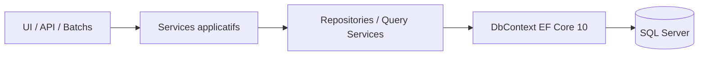
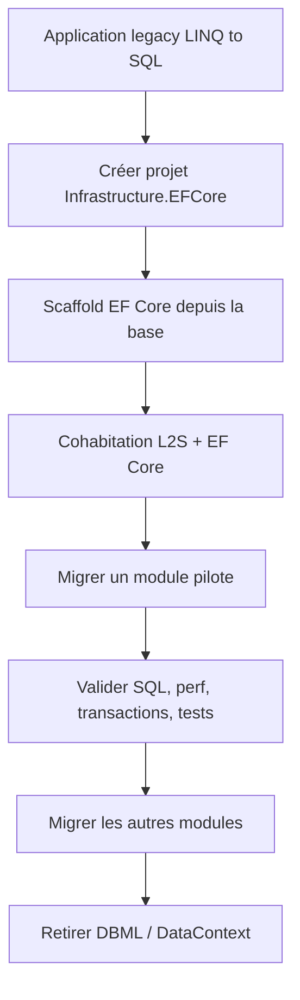
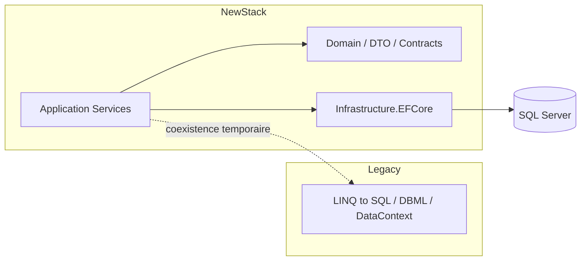
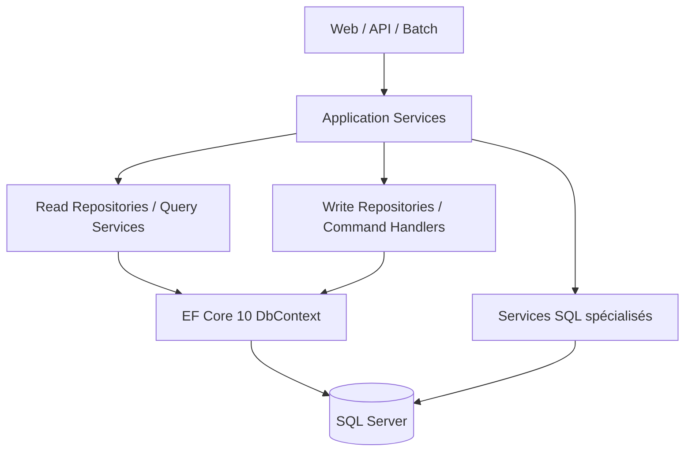

# Migration LINQ to SQL vers EF Core 10

## Objectif

Ce document propose une démarche **pragmatique et progressive** pour migrer une application **LINQ to SQL** vers **Entity Framework Core 10**.

Il vise les cas suivants :

- application historique en couches (`UI -> Services -> Repository/DataAccess -> SQL Server`)
- modèle `.dbml` généré depuis une base existante
- forte dépendance aux `DataContext`, `Table<T>`, `ISingleResult<T>`, procédures stockées et chargement différé
- besoin de sécuriser la migration sans réécrire toute l’application d’un seul coup

---

## 1. Pourquoi migrer

LINQ to SQL est une technologie historique, liée au monde .NET Framework et à SQL Server. EF Core 10, lui, s’inscrit dans l’écosystème .NET moderne et apporte notamment :

- un support natif de **.NET 10**
- un modèle de mapping moderne par conventions + Fluent API
- des **migrations de schéma**
- une meilleure extensibilité
- un écosystème actif (providers, tooling, diagnostics, logging)
- de meilleures capacités d’intégration avec DI, tests, observabilité et architecture moderne

> Point important : la migration n’est **pas** un simple renommage d’API. Il s’agit d’un **changement d’ORM** et parfois d’un changement de paradigme sur le tracking, le chargement des relations, les requêtes SQL et le découpage applicatif.

---

## 2. Vue d’ensemble de la stratégie

### Recommandation principale

Pour un existant LINQ to SQL, la stratégie la plus robuste est :

1. **geler le modèle existant**
2. **générer un modèle EF Core 10 depuis la base**
3. **faire cohabiter temporairement les deux accès aux données**
4. **migrer module par module**
5. **retirer LINQ to SQL seulement à la fin**

### Schéma cible



### Schéma de migration progressive



---

## 3. Écarts conceptuels entre LINQ to SQL et EF Core 10

| Sujet | LINQ to SQL | EF Core 10 |
|---|---|---|
| Contexte | `DataContext` | `DbContext` |
| Entités | Générées via `.dbml` | Classes POCO + Fluent API / annotations |
| Accès table | `Table<TEntity>` | `DbSet<TEntity>` |
| Mapping | Designer DBML | Code first / database first / Fluent API |
| Lazy loading | Souvent implicite selon le modèle | explicite via proxies ou `ILazyLoader` |
| Chargement relations | `LoadWith`, `DeferredLoadingEnabled` | `Include`, `ThenInclude`, split query, lazy loading contrôlé |
| Procédures stockées | fort couplage designer | SQL brut / mapping dédié / exécution explicite |
| Évolution schéma | hors ORM | migrations EF Core |
| Injection de dépendances | souvent absente | native et standard |
| Portabilité | SQL Server-centric | multi-provider |

### Conséquence pratique

Le code qui semblait « marcher naturellement » en LINQ to SQL peut nécessiter en EF Core :

- un `Include(...)`
- une réécriture de projection
- un passage en `AsNoTracking()`
- une explicitation du mapping des clés
- une conversion de requête non traduisible

---

## 4. Architecture de migration recommandée

## 4.1 Découpage cible



## 4.2 Variante propre en solution

```text
src/
  MyApp.Domain/
  MyApp.Application/
  MyApp.Infrastructure.EFCore/
  MyApp.Infrastructure.LegacyL2S/
  MyApp.Web/
  MyApp.Batch/
```

### Principe

- **Domain / DTO / Contracts** : pas de dépendance à EF Core
- **Infrastructure.LegacyL2S** : encapsule l’existant pendant la transition
- **Infrastructure.EFCore** : nouvelle implémentation cible
- **Application** : consomme des interfaces, pas des `DataContext`

---

## 5. Étape 1 — Audit du modèle LINQ to SQL

Avant toute migration, il faut cartographier :

### À inventorier

- nombre d’entités DBML
- tables sans clé primaire claire
- associations `EntityRef<>` / `EntitySet<>`
- procédures stockées utilisées
- fonctions SQL mappées
- requêtes dynamiques
- transactions explicites
- accès batchs / volumétrie
- points de lazy loading implicites
- requêtes projetées vers des objets anonymes ou DTO

### Sortie attendue

Un tableau de priorisation par module :

| Module | Complexité | Risque | Dépendances SQL | Stratégie |
|---|---:|---:|---:|---|
| Référentiel | Faible | Faible | Faible | Migration directe |
| Gestion utilisateur | Moyenne | Moyenne | Moyenne | Migration par repository |
| Batch de consolidation | Forte | Forte | Forte | SQL conservé puis encapsulé |
| Reporting | Forte | Moyenne | Forte | SQL / vues conservées |

---

## 6. Étape 2 — Générer le modèle EF Core 10 depuis la base

Pour une base existante, la stratégie la plus réaliste est **Database First**.

### Packages typiques

```xml
<ItemGroup>
  <PackageReference Include="Microsoft.EntityFrameworkCore" Version="10.0.0" />
  <PackageReference Include="Microsoft.EntityFrameworkCore.SqlServer" Version="10.0.0" />
  <PackageReference Include="Microsoft.EntityFrameworkCore.Design" Version="10.0.0">
    <PrivateAssets>all</PrivateAssets>
    <IncludeAssets>runtime; build; native; contentfiles; analyzers; buildtransitive</IncludeAssets>
  </PackageReference>
  <PackageReference Include="Microsoft.EntityFrameworkCore.Tools" Version="10.0.0">
    <PrivateAssets>all</PrivateAssets>
  </PackageReference>
</ItemGroup>
```

### Commande type de reverse engineering

```bash
dotnet ef dbcontext scaffold \
  "Server=.;Database=MaBase;Trusted_Connection=True;TrustServerCertificate=True" \
  Microsoft.EntityFrameworkCore.SqlServer \
  --context AppDbContext \
  --output-dir Entities \
  --context-dir Context \
  --namespace MyApp.Infrastructure.EFCore.Entities \
  --context-namespace MyApp.Infrastructure.EFCore.Context \
  --use-database-names \
  --no-onconfiguring
```

### Bonne pratique

Le modèle généré ne doit pas devenir votre modèle métier final. Il sert de **point de départ technique**.

---

## 7. Étape 3 — Faire cohabiter LINQ to SQL et EF Core

Pendant la transition, la cohabitation est souvent la stratégie la moins risquée.

### Exemple d’interface applicative

```csharp
public interface ICustomerReadRepository
{
    Task<CustomerDto?> GetByIdAsync(int id, CancellationToken cancellationToken);
}
```

### Implémentation legacy LINQ to SQL

```csharp
public sealed class CustomerReadRepositoryL2S : ICustomerReadRepository
{
    private readonly LegacyDataContext _context;

    public CustomerReadRepositoryL2S(LegacyDataContext context)
    {
        _context = context;
    }

    public Task<CustomerDto?> GetByIdAsync(int id, CancellationToken cancellationToken)
    {
        var dto = _context.Customers
            .Where(x => x.Id == id)
            .Select(x => new CustomerDto
            {
                Id = x.Id,
                Name = x.Name
            })
            .SingleOrDefault();

        return Task.FromResult(dto);
    }
}
```

### Implémentation EF Core 10

```csharp
public sealed class CustomerReadRepositoryEf : ICustomerReadRepository
{
    private readonly AppDbContext _context;

    public CustomerReadRepositoryEf(AppDbContext context)
    {
        _context = context;
    }

    public async Task<CustomerDto?> GetByIdAsync(int id, CancellationToken cancellationToken)
    {
        return await _context.Customers
            .AsNoTracking()
            .Where(x => x.Id == id)
            .Select(x => new CustomerDto
            {
                Id = x.Id,
                Name = x.Name
            })
            .SingleOrDefaultAsync(cancellationToken);
    }
}
```

### Bénéfice

L’application ne dépend plus de l’ORM, mais d’un **contrat stable**.

---

## 8. Conversion des concepts LINQ to SQL vers EF Core 10

## 8.1 `DataContext` -> `DbContext`

### LINQ to SQL

```csharp
public partial class LegacyDataContext : DataContext
{
    public Table<Customer> Customers => GetTable<Customer>();
}
```

### EF Core 10

```csharp
public sealed class AppDbContext : DbContext
{
    public AppDbContext(DbContextOptions<AppDbContext> options) : base(options)
    {
    }

    public DbSet<Customer> Customers => Set<Customer>();

    protected override void OnModelCreating(ModelBuilder modelBuilder)
    {
        modelBuilder.Entity<Customer>(entity =>
        {
            entity.ToTable("Customer");
            entity.HasKey(x => x.Id);
            entity.Property(x => x.Name).HasMaxLength(150);
        });
    }
}
```

## 8.2 `Table<T>` -> `DbSet<T>`

### LINQ to SQL

```csharp
var query = context.Customers.Where(c => c.IsActive);
```

### EF Core 10

```csharp
var query = context.Customers.Where(c => c.IsActive);
```

> La syntaxe LINQ peut rester proche, mais la **traduction SQL** n’est pas toujours identique.

## 8.3 Associations DBML -> navigations + Fluent API

### LINQ to SQL

```csharp
[Association(Name="FK_Order_Customer", ThisKey="CustomerId", OtherKey="Id")]
public Customer Customer { get; set; }
```

### EF Core 10

```csharp
modelBuilder.Entity<Order>(entity =>
{
    entity.HasOne(x => x.Customer)
        .WithMany(x => x.Orders)
        .HasForeignKey(x => x.CustomerId)
        .OnDelete(DeleteBehavior.Restrict);
});
```

## 8.4 `SubmitChanges()` -> `SaveChanges()` / `SaveChangesAsync()`

### LINQ to SQL

```csharp
context.Customers.InsertOnSubmit(customer);
context.SubmitChanges();
```

### EF Core 10

```csharp
context.Customers.Add(customer);
await context.SaveChangesAsync(cancellationToken);
```

## 8.5 Chargement différé

### LINQ to SQL

Le lazy loading est souvent implicite selon le modèle DBML et la configuration du `DataContext`.

### EF Core 10

Deux options principales :

- **préférer le chargement explicite** avec `Include` / `ThenInclude`
- activer le lazy loading via proxies si le coût et le comportement sont maîtrisés

```csharp
services.AddDbContext<AppDbContext>(options =>
    options.UseSqlServer(connectionString)
           .UseLazyLoadingProxies());
```

### Recommandation

Pour une migration maîtrisée, ne pas activer le lazy loading partout par défaut. Le réserver aux zones où il est réellement nécessaire.

---

## 9. Requêtes : ce qui change vraiment

## 9.1 Éviter de supposer que toute requête LINQ sera traduite

Certaines requêtes LINQ to SQL tolérées historiquement doivent être réécrites pour EF Core.

### Exemple risqué

```csharp
var result = context.Customers
    .Where(c => CustomHelpers.Normalize(c.Name) == keyword)
    .ToList();
```

En EF Core, la méthode `CustomHelpers.Normalize(...)` n’est généralement **pas traduisible en SQL**.

### Réécriture possible

```csharp
var normalizedKeyword = Normalize(keyword);

var result = await context.Customers
    .Where(c => c.Name != null)
    .Select(c => new { Entity = c, Normalized = c.Name.Trim().ToUpper() })
    .Where(x => x.Normalized == normalizedKeyword)
    .Select(x => x.Entity)
    .ToListAsync(cancellationToken);
```

## 9.2 Projections : préférer les DTO directs

```csharp
var items = await context.Orders
    .AsNoTracking()
    .Where(x => x.Status == OrderStatus.Validated)
    .Select(x => new OrderListItemDto
    {
        Id = x.Id,
        CustomerName = x.Customer.Name,
        Total = x.TotalAmount
    })
    .ToListAsync(cancellationToken);
```

## 9.3 SQL brut : garder ce qui est critique

Les requêtes très spécialisées, vues techniques, CTE complexes, agrégats ou procédures stockées peuvent être conservés au début.

```csharp
var rows = await context.Set<OrderSummaryRow>()
    .FromSqlInterpolated($@"
        SELECT o.Id, o.TotalAmount
        FROM dbo.[Order] o
        WHERE o.CustomerId = {customerId}")
    .AsNoTracking()
    .ToListAsync(cancellationToken);
```

---

## 10. Procédures stockées et fonctions SQL

Dans de nombreux patrimoines LINQ to SQL, les procédures stockées sont centrales.

### Stratégie recommandée

- **ne pas tout réécrire immédiatement en LINQ**
- encapsuler les appels SQL critiques derrière des services dédiés
- migrer ensuite vers LINQ uniquement si le gain fonctionnel est clair

### Exemple d’exécution d’une commande SQL

```csharp
var affectedRows = await context.Database.ExecuteSqlInterpolatedAsync($@"
    EXEC dbo.psr_rebuild_customer_cache @CustomerId = {customerId}",
    cancellationToken);
```

### Cas de lecture

Pour les lectures complexes, créer des **types de projection** dédiés.

```csharp
public sealed class CustomerSearchRow
{
    public int Id { get; set; }
    public string? Name { get; set; }
    public int Score { get; set; }
}
```

---

## 11. Transactions

Le comportement transactionnel doit être revérifié pendant la migration.

### EF Core 10

```csharp
await using var transaction = await context.Database.BeginTransactionAsync(cancellationToken);

try
{
    context.Customers.Add(customer);
    await context.SaveChangesAsync(cancellationToken);

    context.Orders.Add(order);
    await context.SaveChangesAsync(cancellationToken);

    await transaction.CommitAsync(cancellationToken);
}
catch
{
    await transaction.RollbackAsync(cancellationToken);
    throw;
}
```

### Attention

Si LINQ to SQL et EF Core cohabitent dans la même opération métier, il faut éviter les transactions implicites non coordonnées. Le plus propre est de migrer les **frontières transactionnelles** par cas d’usage.

---

## 12. Concurrence, tracking et état des entités

## 12.1 Lecture seule

Utiliser `AsNoTracking()` sur les lectures non modifiantes.

```csharp
var customers = await context.Customers
    .AsNoTracking()
    .Where(x => x.IsActive)
    .ToListAsync(cancellationToken);
```

## 12.2 Mise à jour partielle

```csharp
var customer = await context.Customers.SingleAsync(x => x.Id == id, cancellationToken);
customer.Name = request.Name;
await context.SaveChangesAsync(cancellationToken);
```

## 12.3 Concurrence optimiste

Prévoir une colonne `rowversion` / `timestamp` si ce n’est pas déjà le cas.

```csharp
public byte[] Version { get; set; } = Array.Empty<byte>();
```

```csharp
modelBuilder.Entity<Customer>()
    .Property(x => x.Version)
    .IsRowVersion();
```

---

## 13. Injection de dépendances

### Recommandation standard

```csharp
services.AddDbContext<AppDbContext>(options =>
    options.UseSqlServer(connectionString));
```

### Variante pour usages batch / traitements parallèles

```csharp
services.AddPooledDbContextFactory<AppDbContext>(options =>
    options.UseSqlServer(connectionString));
```

### Point d’attention

Ne pas enregistrer `DbContext` en singleton. Ne pas conserver un `DbContext` vivant trop longtemps. Une unité de travail doit rester courte.

---

## 14. Migrations de schéma : quand les activer

Pour une migration depuis une base existante :

- au début, EF Core peut être utilisé **sans** piloter le schéma
- ensuite, une fois le modèle stabilisé, les migrations peuvent devenir la source de vérité

### Approche réaliste

1. Phase 1 : base pilotée hors EF
2. Phase 2 : EF Core utilisé pour lire / écrire sans modifier le schéma
3. Phase 3 : adoption progressive des migrations EF Core sur les nouvelles évolutions

---

## 15. Plan de migration par lot

## Lot 1 — Fondations

- créer projet `Infrastructure.EFCore`
- générer `DbContext` et entités
- configurer DI, logs, connexion SQL Server
- écrire tests de fumée sur lectures simples

## Lot 2 — Module pilote

- choisir un module à faible risque
- migrer les repositories de lecture
- migrer ensuite les commandes simples
- comparer SQL et performance

## Lot 3 — Relations et cas métier moyens

- activer `Include` sur cas pertinents
- traiter suppressions / cascades / FK
- sécuriser transactions et tracking

## Lot 4 — SQL complexe

- encapsuler procédures stockées
- conserver SQL brut si nécessaire
- benchmarker avant réécriture LINQ

## Lot 5 — Retrait de LINQ to SQL

- supprimer DBML
- retirer `System.Data.Linq`
- supprimer les implémentations legacy
- stabiliser observabilité et tests de non-régression

---

## 16. Exemple complet avant / après

## Avant — LINQ to SQL

```csharp
public sealed class CustomerService
{
    private readonly LegacyDataContext _context;

    public CustomerService(LegacyDataContext context)
    {
        _context = context;
    }

    public CustomerDetailsDto? GetDetails(int id)
    {
        var customer = _context.Customers.SingleOrDefault(x => x.Id == id);
        if (customer == null)
            return null;

        return new CustomerDetailsDto
        {
            Id = customer.Id,
            Name = customer.Name,
            Orders = customer.Orders
                .Where(o => o.IsActive)
                .Select(o => new OrderDto
                {
                    Id = o.Id,
                    Total = o.TotalAmount
                })
                .ToList()
        };
    }
}
```

## Après — EF Core 10

```csharp
public sealed class CustomerService
{
    private readonly AppDbContext _context;

    public CustomerService(AppDbContext context)
    {
        _context = context;
    }

    public async Task<CustomerDetailsDto?> GetDetailsAsync(int id, CancellationToken cancellationToken)
    {
        return await _context.Customers
            .AsNoTracking()
            .Where(x => x.Id == id)
            .Select(x => new CustomerDetailsDto
            {
                Id = x.Id,
                Name = x.Name,
                Orders = x.Orders
                    .Where(o => o.IsActive)
                    .Select(o => new OrderDto
                    {
                        Id = o.Id,
                        Total = o.TotalAmount
                    })
                    .ToList()
            })
            .SingleOrDefaultAsync(cancellationToken);
    }
}
```

### Gain

- requête projetée directement en DTO
- lecture non trackée
- API asynchrone
- dépendance à `DbContext` standard

---

## 17. Pièges fréquents

## Piège 1 — vouloir reproduire à l’identique le DBML

EF Core n’est pas un clone de LINQ to SQL. Il faut accepter une part de refonte.

## Piège 2 — tout migrer d’un coup

La migration big bang est rarement la bonne stratégie sur un legacy réel.

## Piège 3 — activer le lazy loading partout

Cela masque les accès SQL et peut créer des effets N+1 difficiles à diagnostiquer.

## Piège 4 — réécrire tout le SQL en LINQ immédiatement

Certaines procédures stockées doivent être conservées dans un premier temps.

## Piège 5 — ignorer les différences de traduction LINQ

Une requête qui compile n’est pas forcément correcte en production. Il faut tester le SQL réellement généré.

## Piège 6 — fusionner domaine et entités scaffoldées

Les entités générées depuis la base ne doivent pas contaminer tout le modèle applicatif.

---

## 18. Checklist de migration

## Cadrage

- [ ] Inventaire DBML complet
- [ ] Cartographie procédures stockées / fonctions SQL
- [ ] Identification des modules pilotes
- [ ] Définition de la stratégie de coexistence

## Technique

- [ ] Projet EF Core 10 créé
- [ ] `DbContext` généré
- [ ] Mapping des clés vérifié
- [ ] Relations critiques revues
- [ ] Logs SQL activés
- [ ] Tests de fumée de connexion exécutés

## Migration

- [ ] Repositories de lecture migrés
- [ ] Cas d’écriture simples migrés
- [ ] Transactions revues
- [ ] SQL critiques encapsulés
- [ ] Lazy loading explicitement décidé

## Qualité

- [ ] Comparaison SQL legacy / EF Core
- [ ] Tests de non-régression fonctionnelle
- [ ] Mesures perf sur cas volumétriques
- [ ] Plan de rollback par module

## Décommissionnement

- [ ] `.dbml` retiré
- [ ] `System.Data.Linq` supprimé
- [ ] services legacy supprimés
- [ ] documentation de la nouvelle DAL finalisée

---

## 19. Recommandation finale

Pour un patrimoine LINQ to SQL, la meilleure trajectoire n’est généralement pas :

> « convertir tout le code LINQ to SQL en EF Core ligne à ligne »

La meilleure trajectoire est plutôt :

> « reconstruire progressivement la couche d’accès aux données autour de `DbContext`, d’interfaces stables, de projections DTO et d’un usage explicite du SQL complexe »

En pratique, cela donne :

- **EF Core 10** pour les lectures et écritures courantes
- **SQL brut / procédures stockées** conservés pour les cas les plus techniques
- **migration par module** au lieu d’un basculement global
- **tests + comparaison SQL** comme garde-fou principal

---

## 20. Proposition d’architecture cible



---

## 21. Règle simple de décision

### Migrer en EF Core 10 immédiatement

- CRUD standard
- référentiels
- listes filtrées
- relations simples
- services applicatifs classiques

### Conserver temporairement en SQL explicite

- procédures stockées complexes
- batchs volumétriques
- reporting spécialisé
- CTE / hints / tuning SQL très spécifique
- logique très proche du moteur SQL Server

---

## 22. Next step conseillé

Commencer par un **module pilote de lecture seule**, avec :

1. scaffold EF Core 10
2. repository de lecture en `AsNoTracking()`
3. projection DTO directe
4. comparaison du SQL produit
5. validation fonctionnelle

Une fois ce premier module stabilisé, étendre la migration aux écritures et aux transactions.

---

## 23. Mini template de démarrage

```csharp
public static class DependencyInjection
{
    public static IServiceCollection AddInfrastructureEfCore(
        this IServiceCollection services,
        string connectionString)
    {
        services.AddDbContext<AppDbContext>(options =>
            options.UseSqlServer(connectionString));

        services.AddScoped<ICustomerReadRepository, CustomerReadRepositoryEf>();

        return services;
    }
}
```

---

## 24. Conclusion

Une migration LINQ to SQL vers EF Core 10 est tout à fait faisable, mais elle doit être traitée comme une **modernisation de la DAL**, pas comme un simple portage syntaxique.

La stratégie gagnante est :

- **progressive**
- **pilotée par le risque**
- **orientée contrats / repositories / DTO**
- **pragmatique sur le SQL complexe**

C’est cette approche qui permet d’obtenir une base plus propre, testable, maintenable et compatible avec l’écosystème .NET moderne.
